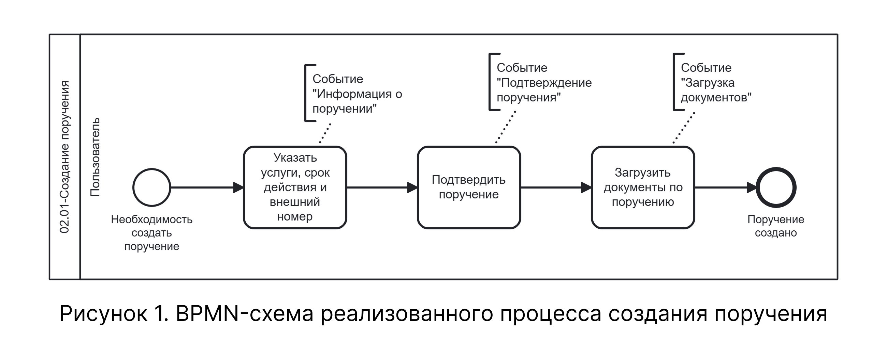

# BPMN-схема процесса создания поручения

На схеме представлен сквозной процесс создания поручения — от инициации мероприятия до сохранения поручения и привязки его к договору. Процесс включает три последовательных события: «Информация о поручении», «Подтверждение поручения» и «Загрузка документов», а также точки ветвления для альтернативных и расширяющих сценариев.

## Реализованная схема процесса

На рисунке 1 приведена BPMN-схема реализованного бизнес-процесса создания поручения, соответствующая сквозной логике выполнения всех событий одним пользователем.

{.center width=1200}

Схема не содержит вложенных подпроцессов. Все действия по событиям «Информация о поручении», «Подтверждение поручения» и «Загрузка документов» представлены на одном уровне декомпозиции.

## Соответствие схемы текстовому описанию

| Узел BPMN-схемы | Соответствие в текстовом описании |
|-----------------|----------------------------------|
| Стартовое событие «Необходимость создать поручение» | Точки входа в процесс: подсистема «Справочники» → «Контрагенты» → выбор договора |
| Действие «Указать услуги, срок действия и внешний номер» | Таблица 2, шаги 1–4 |
| Действие «Подтвердить поручение» | Таблица 3, шаги 5–6 |
| Действие «Загрузить документы по поручению» | Таблица 4, шаги 7–8 |
| Завершающее событие «Поручение создано» | Таблица 4, шаг 8 |
| Шлюз «Поручение подтверждено?» | Таблица 2.1 — альтернативный сценарий «Отклонение поручения» |
| Шлюз «Создание отменено?» | Таблица 2.3 — альтернативный сценарий «Отмена создания поручения» |