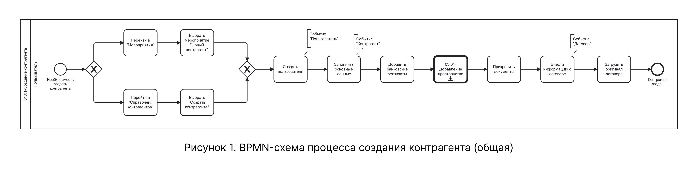
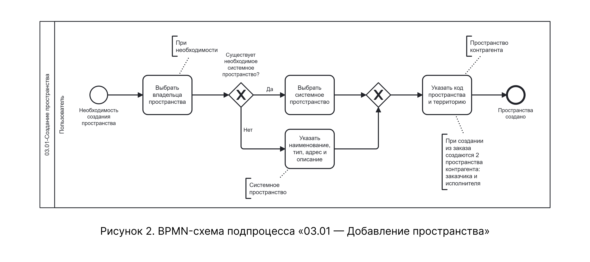

# BPMN-схема процесса создания контрагента

На схеме представлен процесс создания контрагента — от инициации мероприятия до генерации учетных данных и отправки их пользователю. Процесс включает три последовательных события: «Пользователь», «Контрагент» и «Договор», а также точки ветвления для альтернативных и расширяющих сценариев.

## Общая схема процесса

На рисунке 1 приведена BPMN-схема верхнего уровня, охватывающая все события процесса создания контрагента.

{.center width=1200}

В состав схемы входит подпроцесс 03.01 — Добавление пространства, который детализирован на отдельной схеме (см. рисунок 2). Данный подпроцесс используется на шаге 10 нормального сценария, когда пользователь переходит к добавлению системного и пользовательского пространства для контрагента.

## Подпроцесс 03.01 — Добавление пространства

На рисунке 2 представлена декомпозиция подпроцесса «03.01 — Добавление пространства». Подпроцесс описывает логику выбора или создания системного пространства, а также последующее создание связанного с ним пользовательского пространства.

{.center width=1200}

Подпроцесс вызывается в рамках события «Контрагент» и покрывает шаги 10–13 нормального сценария, а также альтернативные сценарии, описанные в таблицах 3.6–3.9 расширенного нормального сценария.

## Соответствие общей схемы текстовому описанию

| Узел BPMN-схемы | Соответствие в текстовом описании |
|-----------------|----------------------------------|
| Стартовое событие «Инициация мероприятия» | Точки входа в процесс: подсистема «Мероприятия» или справочник «Контрагенты» |
| Действие «Создать пользователя» | Таблица 2.1 |
| Действие «Заполнить основные данные» | Таблица 2.2, шаги 3–4.3 |
| Действие «Добавить банковские реквизиты» | Таблица 2.2, шаги 5–9 |
| Подпроцесс «03.01 — Добавление пространства» | Таблица 2.2, шаги 10–13 |
| Действие «Прикрепить документы» | Таблица 2.2, шаги 14–15 |
| Действие «Внести информацию о договоре» | Таблица 2.3, шаги 16–23 |
| Действие «Загрузить оригинал договора» | Таблица 2.3, шаг 24 |
| Завершающее событие «Контрагент создан» | Таблица 5, шаг 25 |