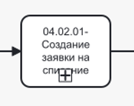
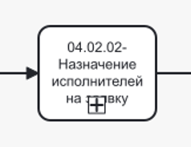
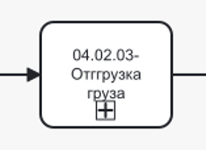
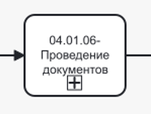

# Управление процессом списания товара со склада



Для того, **чтобы таблица была видна полностью, перейдите в режим чтения**:
* найдите иконку «Режим чтения» рядом с иконкой-шестеренкой в правом углу;
* кликните по иконке.
Будет скрыто боковое меню и оглавление, а основная часть информации развернута на всю страницу. 

**Для выхода нажмите «Esc» на клавиатуре**.



## № 1. Списание товара со склада

Процесс списания товара со склада состоит из множества событий, доступ к которым имеют разные пользователи с разными ролями. Для упрощения описан пример взаимодействия администратора (с доступом ко всем функциям).

BPMN-схема процесса списания товара со склада находится на странице «BPMN-схема». Формы интерфейса с идентификаторами — на странице «Интерфейс».

### 1.1. Точки входа в процесс

Создание заявки возможно из подсистемы «Мероприятия». Последовательность шагов для перехода к сценарию создания заявки на списание описана в Таблице 1.

**Таблица 1. Переход к созданию заявки на списание товара со склада через подсистему «Мероприятия»**

| Шаг | Действия пользователя | Ожидаемый ответ системы | Идентификатор формы | Примечание |
|-----|----------------------|------------------------|---------------------|------------|
| 1 | Кликнуть в боковом меню по подсистеме «Мероприятия» | Система выполняет переход в подсистему «Мероприятия». Отображается страница со списком мероприятий | | — |
| 2 | Кликнуть по кнопке «Создать мероприятие» | Система отображает выпадающий список со значениями: «Новый контрагент», «Работа склада» | | — |
| 3 | Кликнуть по значению «Работа склада» | Система инициирует мероприятие «Создание контрагента». Отображается стартовая страница мероприятия | | — |

### 1.2. Нормальный сценарий списания товаров со склада

Под основной информацией понимаются данные, без которых создание заявки невозможно: тип заявки, планируемая дата списания, причина списания, контрагент, договор, информация об списываемых товарах.

Пользовательский путь описан в Таблицах 2.1 - 2.4.

**Таблица 2.1. Создание заявки на списание**
| Шаг | Действия пользователя | Ожидаемый ответ системы | Идентификатор формы | Соответствие на BPMN-схеме | Примечание |
|-----|----------------------|------------------------|---------------------|---------------------------|------------|
| 1 | Выбрать тип заявки «Списание» в поле «Тип заявки» | Система фиксирует выбранное значение. Состав последующих событий определяется типом «Списание» | | {.center width=150} | Развернутая схема подпроцесса представлена на странице «BPMN-схема» |
| 2 | Указать планируемую дату списания | Система отображает датапикер, выбранная дата фиксируются. Альтернативный сценарий по фиксированию движений основных средств описан в Таблице 3. | | | — |
| 3 | Выбрать причину списания для номенклатуры в поле «Причина списания»: Поставка; Брак; Бой; Истечение срока годности | Система фиксирует выбранное значение. | | | — |
| 4 | Ввести комментарий и прикрепить файлы для конкретизации информации | Система отображает введенный текст. Прикрепленные файлы отображаются в интерфейсе | | | Данное поле необязательно для заполнения |
| 5 | Выбрать контрагента, ответственного по заявке, из выпадающего списка в поле «Контрагент» | Система отображает список доступных контрагентов. Выбранное значение фиксируется | | | — |
| 6 | Выбрать договор из выпадающего списка в поле «Договор» | Система отображает список договоров, связанных с выбранным контрагентом. После выбора отображаются и частично предзаполняются поля «Поставщик» и «Получатель» | | | — |
| 7 | Указать пространство поставщика, из которого будет отгружен товар | Система отображает список пространств, связанных с поставщиком. | | | — |
| 8 | Указать контрагента-перевозчика | Система отображает список доступных контрагентов. Выбранное значение фиксируется. | | | Выбор перевозчика — необязателен. Альтернативный сценарий добавления перевозчика описан в таблицах 4.1-4.2 |
| 9 | Указать пространство получателя, в которое будет отгружен товар | Система отображает список пространств, связанных с получателем. | | | Выбор пространства поступления необязателен. |
| 10 | Кликнуть по кнопке «Далее» | Система переключает с вкладки «Основное» на вкладку «Номенклатура», меняет модальное окно | | | — |
| 11 | Ввести в поисковой строке наименование, артикул или SAP-код необходимого товара | Система выполняет поиск в справочнике остатков и отображает подходящие значения в выпадающем списке. | | | — |
| 12 | Кликнуть по значению в выпадающем списке | Система открывает модальное окно с информацией о выбранном товаре и полями для ввода. | | | — |
| 13 | Указать количество требуемой номенклатуры | Система запоминает выбранное значение | | | — |
| 14 | Нажать кнопку «Сохранить» в модальном окне | Система добавляет товар в список заявки. Модальное окно закрывается | | | — |
| 15 | Кликнуть на кнопку «Создать» | Система создает заявку и переходит к окну с финальной информацией. | | | Количество добавляемых товаров в заявку не ограничено. При необходимости можно повторить шаги с 11 по 14 для добавления товаров |
| 16 | Кликнуть на кнопку «Подтвердить» | Система закрывает модальное окно и происходит переход к событию «Назначение исполнителей» | | | — |

**Таблица 2.2. Событие «Назначение исполнителей»**
| Шаг | Действия пользователя | Ожидаемый ответ системы | Идентификатор формы | Соответствие на BPMN-схеме | Примечание |
|-----|----------------------|------------------------|---------------------|---------------------------|------------|
| 17 | Выбрать контрагента из выпадающего списка для события «Разгрузка груза» | Система отображает список доступных контрагентов. Выбранное значение фиксируется. | | {.center width=150} | Развернутая схема подпроцесса представлена на странице «BPMN-схема» |
| 18 | Выбрать контрагента из выпадающего списка для события «Отгрузка груза» | Система отображает список доступных контрагентов. Выбранное значение фиксируется. | | | — |
| 19 | Выбрать контрагента из выпадающего списка для события «Проведение документов» | Система отображает список доступных контрагентов. Выбранное значение фиксируется. | | | — |
| 20 | Указать комментарий и прикрепить документ | Система отображает введенный текст. Прикрепленные файлы отображаются в интерфейсе | | | Данное поле необязательно для заполнения, данный шаг можно пропустить |
| 21 | Кликнуть по кнопке «Подтвердить» | Система закрывает модальное окно и происходит переход к событию «Разгрузка груза» | | | — |

**Таблица 2.3. Событие «Отгрузка груза»**
| Шаг | Действия пользователя | Ожидаемый ответ системы | Идентификатор формы | Соответствие на BPMN-схеме | Примечание |
|-----|----------------------|------------------------|---------------------|---------------------------|------------|
| 22 | Проверить соответствие информации, указанной в документах | Система ожидает ответ пользователя. С экрана возможен переход к просмотру информации о планируемых к списанию товарах, о поставщике, о перевозчике и о получателе. | | {.center width=150} | Развернутая схема подпроцесса представлена на странице «BPMN-схема» |
| 23 | Кликнуть по кнопке «Начать событие» | Система отображает модальное окно с информацией о событии и информацией о грузе. Альтернативный сценарий по замене товара описан в Таблице 4.2. | | | — |
| 24 | Кликнуть по кнопке «Завершить» | Система сохраняет введенную информацию, закрывает страницу, происходит переход к событию «Проведение документов» | | | — |

**Таблица 2.4. [Событие «Проведение документов»](*key_process)**
| Шаг | Действия пользователя | Ожидаемый ответ системы | Идентификатор формы | Соответствие на BPMN-схеме | Примечание |
|-----|----------------------|------------------------|---------------------|---------------------------|------------|
| 25 | Проверить соответствие информации, указанной в документах | Система ожидает ответ пользователя. С экрана возможен переход к просмотру информации о товарах, о поставщике, о перевозчике и о получателе. | | {.center width=150} | Развернутая схема подпроцесса представлена на странице «BPMN-схема» |
| 26 | Загрузить подписанные документы | Система отображает загруженные файлы в интерфейсе. | | | — |
| 27 | Кликнуть по кнопке «Провести» | Система завершает событие и отображает финальную страницу по событию | | | — |

### 1.3. Расширение нормального сценария процесса списания товара со склада

**Таблица 3. Альтернативный сценарий списания товара со склада (движение основных средств)**

| Шаг | Действия пользователя | Ожидаемый ответ системы | Идентификатор формы | Соответствие на BPMN-схеме | Примечание |
|-----|----------------------|------------------------|---------------------|---------------------------|------------|
| 1 | Включить свитчер «Основные средства» | Система меняет блок с выбором ответственного контрагента и договора на выбор ответственного контрагента и пространства | | {.center width=150} | Развернутая схема подпроцесса представлена на странице «BPMN-схема» |
| 2 | Указать планируемую дату списания | Система отображает датапикер. Выбранная дата фиксируется | | | — |
| 3 | Выбрать причину списания в поле «Причина списания»: Поставка; Брак; Бой; Истечение срока годности | Система фиксирует выбранное значение | | | — |
| 4 | Ввести комментарий и прикрепить файлы для конкретизации информации | Система отображает введенный текст. Прикрепленные файлы отображаются в интерфейсе | | | Данное поле необязательно для заполнения |
| 5 | Выбрать контрагента, ответственного по заявке, из выпадающего списка в поле «Контрагент» | Система отображает список доступных контрагентов. Выбранное значение фиксируется | | | — |
| 6 | Выбрать пространство, в котором будет происходить перемещение номенклатуры | Система отображает список доступных пространств, связанных с выбранным ответственным контрагентом. Выбранное значение фиксируется | | | — |
| 7 | Кликнуть по кнопке «Далее» | Система переключает с вкладки «Основное» на вкладку «Номенклатура», меняет модальное окно | | | Далее происходит переход к шагу 11 основного сценария (см. Таблицу 2.1) |

### 1.4. Расширения нормального сценария использования

В Таблицах 4.1-4.2 описаны пользовательские сценарии, расширяющие основной.

**Таблица 4.1. Расширенный сценарий указания данных о перевозчике**

| Шаг | Действия пользователя | Ожидаемый ответ системы | Идентификатор формы | Соответствие на BPMN-схеме | Примечание |
|-----|----------------------|------------------------|---------------------|---------------------------|------------|
| 1 | Кликнуть по команде «Добавить» | Система отображает блок с полями для указания нового контрагента | | {.center width=150} | Развернутая схема подпроцесса представлена на странице «BPMN-схема» |
| 2 | Заполнить поле «Фамилия Имя Отчество» | Система запоминает введенные значения и отображает их в интерфейсе | | | В интерфейсе по клику на специальную иконку можно вернуться к выбору контрагента-перевозчика из выпадающего списка |
| 3 | Указать марку и номер машины | Система запоминает введенные значения и отображает их в интерфейсе | | | — |
| 4 | Указать серию и номер паспорта | Система запоминает введенные значения и отображает их в интерфейсе | | | — |

**Таблица 4.2. Расширенный сценарий добавления перевозчика в качестве контрагента**

| Шаг | Действия пользователя | Ожидаемый ответ системы | Идентификатор формы | Соответствие на BPMN-схеме | Примечание |
|-----|----------------------|------------------------|---------------------|---------------------------|------------|
| 1 | Кликнуть по команде «Добавить» | Система отображает блок с полями для указания нового контрагента | | {.center width=150} | Развернутая схема подпроцесса представлена на странице «BPMN-схема» |
| 2 | Кликнуть по команде «Перейти» | Происходит переход к странице мероприятия по созданию контрагента | | | Дальнейшие шаги соответствуют сценарию «Создание контрагента» (см. страницу 01 Управление контрагентами → Описание)|

[*key_process]: Событие «Проведение документов» одинаково и для заявки списания, и для заявки поступления. Для подчеркивания схожести номер события соответствует нумерации процесса из общей схемы процесса поступления товара на склад.