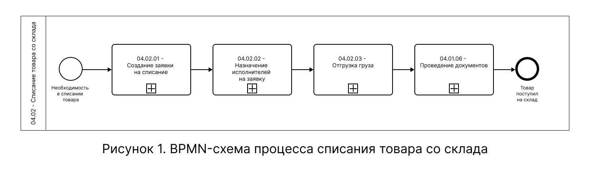
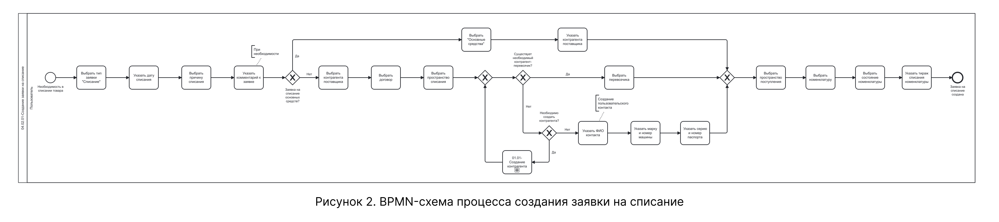
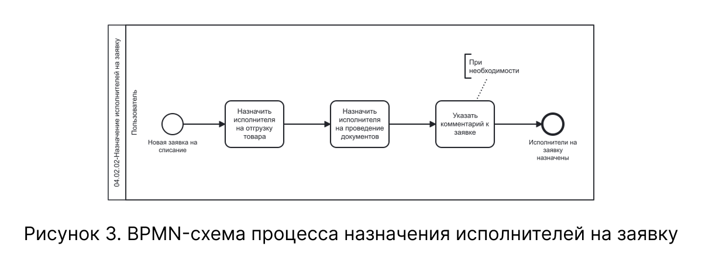
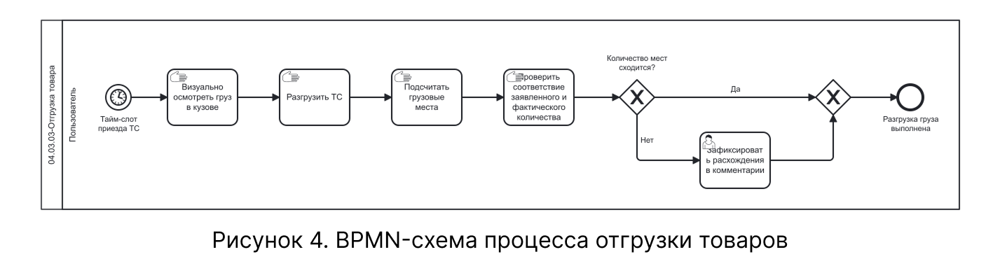
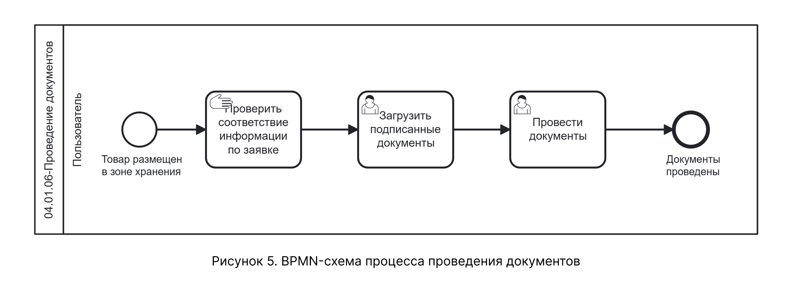

# BPMN-схема процесса списания товара со склада

На схеме представлен процесс списания товара со склада — от возникновения необходимости в списании до списания товара со склада. Процесс включает четыре последовательных подпроцесса: «Создание заявки на списание», «Назначение исполнителей на заявку», «Отгрузка груза» и «Проведение документов», а также точки ветвления для альтернативных и расширяющих сценариев.

Схема содержит следующие свернутые подпроцессы, которые детализированы на отдельных схемах:

- 04.02.01 — Создание заявки на списание — рисунок 2;
- 04.02.02 — Назначение исполнителей на заявку — рисунок 3;
- 04.02.03 — Отгрузка груза — рисунок 4;
- 04.01.06 — Проведение документов — рисунок 5.

## Общая схема процесса

На рисунке 1 приведена BPMN-схема верхнего уровня, охватывающая все подпроцессы процесса списания товара со склада.

{.center width=1200}

## Подпроцесс 04.02.01 — Создание заявки на списание

На рисунке 2 представлена декомпозиция подпроцесса «04.02.01 — Создание заявки на списание». Подпроцесс описывает логику заполнения основной информации заявки: выбор типа заявки, указание даты и причины списания, выбор контрагента и договора, добавление номенклатуры, а также ветвление для создания нового перевозчика.

{.center width=1200}

Подпроцесс охватывает шаги 1–16 нормального сценария (см. Таблицу 2.1 на странице «Описание»), альтернативный сценарий движения основных средств (Таблица 3), а также расширенные сценарии указания данных о перевозчике (Таблицы 4.1–4.2). В рамках расширенного сценария добавления перевозчика в качестве контрагента (Таблица 4.2) может быть вызван внешний подпроцесс «01.01 — Создание контрагента», детальное описание которого приведено на странице «01 Управление контрагентами → Описание».

## Подпроцесс 04.02.02 — Назначение исполнителей на заявку

На рисунке 3 представлена декомпозиция подпроцесса «04.02.02 — Назначение исполнителей на заявку». Подпроцесс описывает логику назначения ответственных контрагентов на события «Отгрузка груза» и «Проведение документов».

{.center width=1200}

Подпроцесс охватывает шаги 17–21 нормального сценария (см. Таблицу 2.2 на странице «Описание»).

## Подпроцесс 04.02.03 — Отгрузка груза

На рисунке 4 представлена декомпозиция подпроцесса «04.02.03 — Отгрузка груза». Подпроцесс описывает логику физической отгрузки товара со склада: визуальный осмотр груза, разгрузку транспортного средства, подсчет грузовых мест и проверку соответствия заявленного и фактического количества.

{.center width=1200}

Подпроцесс охватывает шаги 22–24 нормального сценария (см. Таблицу 2.3 на странице «Описание»).

## Подпроцесс 04.01.06 — Проведение документов

На рисунке 5 представлена декомпозиция подпроцесса «04.01.06 — Проведение документов». Подпроцесс описывает логику завершающего этапа: проверку соответствия информации по заявке, загрузку подписанных документов и финальное проведение.

{.center width=1200}

Подпроцесс охватывает шаги 25–27 нормального сценария (см. Таблицу 2.4 на странице «Описание»).

## Соответствие схемы текстовому описанию

| Узел BPMN-схемы | Соответствие в текстовом описании |
|-----------------|----------------------------------|
| Стартовое событие «Необходимость в списании товара» | Таблица 1 |
| Подпроцесс «04.02.01 — Создание заявки на списание» | Таблицы 2.1, 3, 4.1 - 4.2  |
| Подпроцесс «04.02.02 — Назначение исполнителей на заявку» | Таблица 2.2  |
| Подпроцесс «04.02.03 — Отгрузка груза» | Таблица 2.3 |
| Подпроцесс «04.01.06 — Проведение документов» | Таблица 2.4, шаги 25 - 26 |
| Завершающее событие «Товар поступил на склад» | Таблица 2.4, шаг 27 |