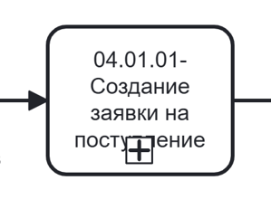
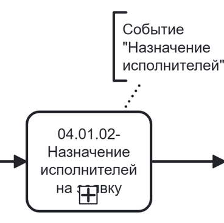
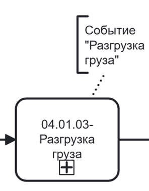
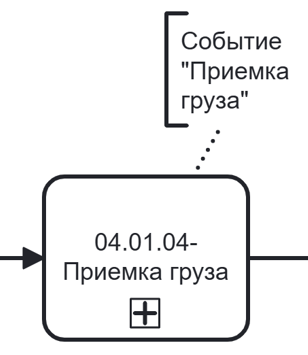
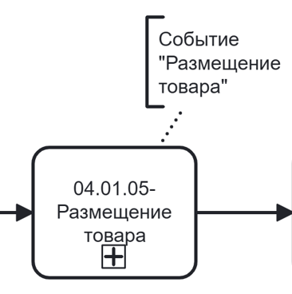
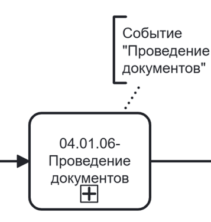

# Управление процессом поступления товара на склад



Для того, **чтобы таблица была видна полностью, перейдите в режим чтения**:
* найдите иконку «Режим чтения» рядом с иконкой-шестеренкой в правом углу;
* кликните по иконке.
Будет скрыто боковое меню и оглавление, а основная часть информации развернута на всю страницу. 

**Для выхода нажмите «Esc» на клавиатуре**.



## № 1. Поступление товара на склад

Процесс поступления товара на склад состоит из множества событий, доступ к которым имеют разные пользователи с разными ролями. Для упрощения описан пример взаимодействия администратора (с доступом ко всем функциям).

BPMN-схема процесса поступления товара на склад находится на странице «BPMN-схема». Формы интерфейса с идентификаторами — на странице «Интерфейс».

### 1.1. Точки входа в процесс

Создание заявки возможно из подсистемы «Мероприятия». Последовательность шагов для перехода к сценарию создания заявки на поступление описана в Таблице 1.

**Таблица 1. Переход к созданию заявки на поступление через подсистему «Мероприятия»**

| Шаг | Действия пользователя | Ожидаемый ответ системы | Идентификатор формы | Примечание |
|-----|----------------------|------------------------|---------------------|------------|
| 1 | Кликнуть в боковом меню по подсистеме «Мероприятия» | Система выполняет переход в подсистему «Мероприятия». Отображается страница со списком мероприятий | | — |
| 2 | Кликнуть по кнопке «Создать мероприятие» | Система отображает выпадающий список со значениями: «Новый контрагент», «Работа склада» | | — |
| 3 | Кликнуть по значению «Работа склада» | Система инициирует мероприятие «Создание контрагента». Отображается стартовая страница мероприятия | | — |

### 1.2. Нормальный сценарий поступления товара на склад

Под основной информацией понимаются данные, без которых создание заявки невозможно: тип заявки, планируемая дата начала, тип хранения, контрагент, договор, информация об используемой номенклатуре.

Нормальный сценарий поступления товара на склад описан в Таблицах 2.1 - 2.6.

**Таблица 2.1. Создание заявки на поступление**

| Шаг | Действия пользователя | Ожидаемый ответ системы | Идентификатор формы | Соответствие на BPMN-схеме | Примечание |
|-----|----------------------|------------------------|---------------------|---------------------------|------------|
| 1 | Выбрать тип заявки «Поступление» в поле «Тип заявки» | Система фиксирует выбранное значение. Состав последующих событий определяется типом «Поступление» | | {.center width=150} | Развернутая схема подпроцесса представлена на странице «BPMN-схема» |
| 2 | Указать планируемую дату начала работ и завершения срока хранения по заявке в поле «Планируемая дата начала» и «Завершение срока хранения» | Система отображает датапикер. Выбранные даты фиксируются, автоматически рассчитывается длительность. Альтернативный сценарий по фиксированию движений основных средств описан в Таблице 3. | | | — |
| 3 | Выбрать тип хранения для номенклатуры в поле «Хранение»: • Длительное; • Кросс-докинг | Система фиксирует выбранное значение. | | | — |
| 4 | Ввести комментарий и прикрепить файлы для конкретизации информации | Система отображает введенный текст. Прикрепленные файлы отображаются в интерфейсе | | | Данное поле необязательно для заполнения |
| 5 | Выбрать контрагента, ответственного по заявке, из выпадающего списка в поле «Контрагент» | Система отображает список доступных контрагентов. Выбранное значение фиксируется | | | — |
| 6 | Выбрать договор из выпадающего списка в поле «Договор» | Система отображает список договоров, связанных с выбранным контрагентом. После выбора отображаются и частично предзаполняются поля «Поставщик» и «Получатель» | | | — |
| 7 | Указать пространство поставщика, из которого будет отгружен товар | Система отображает список пространств, связанных с поставщиком. | | | — |
| 8 | Указать контрагента-перевозчика | Система отображает список доступных контрагентов. Выбранное значение фиксируется. | | | Выбор перевозчика — необязателен. Альтернативный сценарий добавления перевозчика описан в таблицах 4.1-4.2 |
| 9 | Указать пространство получателя, в которое будет отгружен товар | Система отображает список пространств, связанных с получателем. | | | — |
| 10 | Кликнуть по кнопке «Далее» | Система переключает с вкладки «Основное» на вкладку «Номенклатура», меняет модальное окно | | | — |
| 11 | Ввести в поисковой строке наименование, артикул или SAP-код необходимой номенклатуры | Система выполняет поиск в справочнике номенклатуры и отображает подходящие значения в выпадающем списке. Альтернативный вариант, когда номенклатура не найдена описан в Таблице 4.3. | | | — |
| 12 | Кликнуть по значению в выпадающем списке | Система открывает модальное окно с информацией о выбранной номенклатуре и полями для ввода. | | | — |
| 13 | Указать состояние номенклатуры | Система запоминает выбранное значение | | | — |
| 14 | Указать количество требуемой номенклатуры | Система запоминает выбранное значение | | | — |
| 15 | Нажать кнопку «Сохранить» в модальном окне | Система добавляет номенклатуру в список номенклатуры заявки. Модальное окно закрывается | | | Количество добавляемой номенклатуры в заявку не ограничено. При необходимости можно повторить шаги с 11 по 15 для добавления номенклатуры |
| 16 | Кликнуть на кнопку «Создать» | Система создает заявку и переходит к окну с финальной информацией. | | | — |
| 17 | Кликнуть на кнопку «Подтвердить» | Система закрывает модальное окно и происходит переход к событию «Назначение исполнителей» | | | — |

**Таблица 2.2. Событие «Назначение исполнителей»**
| Шаг | Действия пользователя | Ожидаемый ответ системы | Идентификатор формы | Соответствие на BPMN-схеме | Примечание |
|-----|----------------------|------------------------|---------------------|---------------------------|------------|
| 18 | Выбрать контрагента из выпадающего списка для события «Разгрузка груза» | Система отображает список доступных контрагентов. Выбранное значение фиксируется. | | {.center width=200} | Развернутая схема подпроцесса представлена на странице «BPMN-схема» |
| 19 | Выбрать контрагента из выпадающего списка для события «Приёмка груза» | Система отображает список доступных контрагентов. Выбранное значение фиксируется. | | | — |
| 20 | Выбрать контрагента из выпадающего списка для события «Размещение товара» | Система отображает список доступных контрагентов. Выбранное значение фиксируется. | | | — |
| 21 | Выбрать контрагента из выпадающего списка для события «Проведение документов» | Система отображает список доступных контрагентов. Выбранное значение фиксируется. | | | — |
| 22 | Указать комментарий и прикрепить документ | Система отображает введенный текст. Прикрепленные файлы отображаются в интерфейсе | | | Данное поле необязательно для заполнения, данный шаг можно пропустить |
| 23 | Кликнуть по кнопке «Подтвердить» | Система закрывает модальное окно и происходит переход к событию «Разгрузка груза» | | | — |

**Таблица 2.3. Событие «Разгрузка груза»**
| Шаг | Действия пользователя | Ожидаемый ответ системы | Идентификатор формы | Соответствие на BPMN-схеме | Примечание |
|-----|----------------------|------------------------|---------------------|---------------------------|------------|
| 24 | Кликнуть по кнопке «Начать событие» | Система отображает модальное окно с информацией о событии и информацией о грузе | | {.center width=200} | Развернутая схема подпроцесса представлена на странице «BPMN-схема» |
| 25 | Проверить соответствие информации из документа и фактически поступившего груза и указать зону погрузки | Система отображает доступный список компонентов топологии склада. После выбора запоминает и фиксирует выбранное значение. Альтернативный сценарий, когда план и факт по номенклатуре не сошелся описан в Таблице 4.4. | | | — |
| 26 | Кликнуть по кнопке «Завершить» | Система сохраняет введенную информацию, закрывает страницу, происходит переход к событию «Приёмка груза» | | | — |

**Таблица 2.4. Событие «Приёмка груза»**
| Шаг | Действия пользователя | Ожидаемый ответ системы | Идентификатор формы | Соответствие на BPMN-схеме | Примечание |
|-----|----------------------|------------------------|---------------------|---------------------------|------------|
| 27 | Проверить качество и количество груза и если все показатели совпадают, кликнуть по кнопке «Завершить» | Система закрывает модальное окно, происходит переход к событию «Размещение товара». Альтернативные сценарии для фиксации расхождений описаны в Таблицах 4.5-4.7. | | {.center width=200} | Развернутая схема подпроцесса представлена на странице «BPMN-схема» |

**Таблица 2.5. Событие «Размещение товара»**
| Шаг | Действия пользователя | Ожидаемый ответ системы | Идентификатор формы | Соответствие на BPMN-схеме | Примечание |
|-----|----------------------|------------------------|---------------------|---------------------------|------------|
| 28 | Сверить документы в заявке и кликнуть по кнопке «Начать событие» | Система отображает модальное окно с информацией по предыдущим событиям, после клика по кнопке показывает модальное окно со списком всей номенклатуры. | | {.center width=200} | Развернутая схема подпроцесса представлена на странице «BPMN-схема» |
| 29 | Кликнуть по полю «Место хранения» в строке с нужной номенклатурой | Система открывает модальное окно с иерархией склада | | | Место хранения необходимо указать для каждой строчки из списка |
| 30 | Указать количество размещаемой номенклатуры на каждом из ярусов | Система запоминает и отображает введенные значения | | | — |
| 31 | Кликнуть по кнопке «Сохранить» | Система сохраняет введенные значения, закрывает модальное окно и отображает указанные места хранения в списке с товарами | | | — |
| 32 | Кликнуть по кнопке «Завершить» | Система закрывает модальное окно и отображает финальную страницу с общей информацией по прошедшему событию | | | — |
| 33 | Кликнуть по кнопке «Следующее событие» | Система закрывает финальную страницу и происходит переход к следующему событию | | | — |

**Таблица 2.6. Событие «Проведение документов»**
| Шаг | Действия пользователя | Ожидаемый ответ системы | Идентификатор формы | Соответствие на BPMN-схеме | Примечание |
|-----|----------------------|------------------------|---------------------|---------------------------|------------|
| 34 | Проверить соответствие информации, указанной в документах | Система ожидает ответ пользователя. С экрана возможен переход к просмотру информации о поступившей номенклатуре, о поставщике, о перевозчике и о получателе. | | {.center width=200} | Развернутая схема подпроцесса представлена на странице «BPMN-схема» |
| 35 | Загрузить подписанные документы | Система отображает загруженные файлы в интерфейсе. | | | — |
| 36 | Кликнуть по кнопке «Провести» | Система завершает событие и отображает финальную страницу по событию | | | — |

### 1.3. Расширение нормального сценария процесса поступления товара на склад

**Таблица 3. Альтернативный сценарий поступления товара на склад (движение основных средств)**

| Шаг | Действия пользователя | Ожидаемый ответ системы | Идентификатор формы | Соответствие на BPMN-схеме | Примечание |
|-----|----------------------|------------------------|---------------------|---------------------------|------------|
| 1 | Включить свитчер «Основные средства» | Система меняет блок с выбором ответственного контрагента и договора на выбор ответственного контрагента и пространства | | {.center width=150} | Развернутая схема подпроцесса представлена на странице «BPMN-схема» |
| 2 | Указать планируемую дату начала работ и завершения срока хранения по заявке в поле «Планируемая дата начала» и «Завершение срока хранения» | Система отображает датапикер. Выбранные даты фиксируются, автоматически рассчитывается длительность | | | — |
| 3 | Выбрать тип хранения для номенклатуры в поле «Хранение»: Длительное; Кросс-докинг | Система фиксирует выбранное значение| | | — |
| 4 | Ввести комментарий и прикрепить файлы для конкретизации информации | Система отображает введенный текст. Прикрепленные файлы отображаются в интерфейсе | | | Данное поле необязательно для заполнения |
| 5 | Выбрать контрагента, ответственного по заявке, из выпадающего списка в поле «Контрагент» | Система отображает список доступных контрагентов. Выбранное значение фиксируется | | | — |
| 6 | Выбрать пространство, в котором будет происходить перемещение номенклатуры | Система отображает список доступных пространств, связанных с выбранным ответственным контрагентом. Выбранное значение фиксируется | | | — |
| 7 | Кликнуть по кнопке «Далее» | Система переключает с вкладки «Основное» на вкладку «Номенклатура», меняет модальное окно | | | Далее происходит переход к шагу 11 основного сценария (см. Таблицу 2.1) |

### 1.4. Расширения нормального сценария использования

В Таблицах 4.1-4.7 описаны пользовательские сценарии, расширяющие основной.

**Таблица 4.1. Расширенный сценарий указания данных о перевозчике**

| Шаг | Действия пользователя | Ожидаемый ответ системы | Идентификатор формы | Соответствие на BPMN-схеме | Примечание |
|-----|----------------------|------------------------|---------------------|---------------------------|------------|
| 1 | Кликнуть по команде «Добавить» | Система отображает блок с полями для указания нового контрагента | | {.center width=150} | Развернутая схема подпроцесса представлена на странице «BPMN-схема» |
| 2 | Заполнить поле «Фамилия Имя Отчество» | Система запоминает введенные значения и отображает их в интерфейсе | | | В интерфейсе по клику на специальную иконку можно вернуться к выбору контрагента-перевозчика из выпадающего списка |
| 3 | Указать марку и номер машины | Система запоминает введенные значения и отображает их в интерфейсе | | | — |
| 4 | Указать серию и номер паспорта | Система запоминает введенные значения и отображает их в интерфейсе | | | — |

**Таблица 4.2. Расширенный сценарий добавления перевозчика в качестве контрагента**

| Шаг | Действия пользователя | Ожидаемый ответ системы | Идентификатор формы | Соответствие на BPMN-схеме | Примечание |
|-----|----------------------|------------------------|---------------------|---------------------------|------------|
| 1 | Кликнуть по команде «Добавить» | Система отображает блок с полями для указания нового контрагента | | {.center width=150} | Развернутая схема подпроцесса представлена на странице «BPMN-схема» |
| 2 | Кликнуть по команде «Перейти» | Происходит переход к странице мероприятия по созданию контрагента | | | Дальнейшие шаги соответствуют сценарию «Создание контрагента» (см. страницу «01 Управление контрагентами → Описание»)|

**Таблица 4.3. Расширенный сценарий добавления новой номенклатуры**

| Шаг | Действия пользователя | Ожидаемый ответ системы | Идентификатор формы | Соответствие на BPMN-схеме | Примечание |
|-----|----------------------|------------------------|---------------------|---------------------------|------------|
| 1 | Кликнуть по команде «Добавить» | Система открывает модальное окно для создания номенклатуры | | {.center width=150} | Дальнейшие шаги соответствуют сценарию «Создание номенклатуры» (см. страницу 03 Управление справочной информацией → 03.03 Номенклатура). После того как номенклатура добавлена, она отражается в выпадающем списке и дальше происходит переход на шаг 11 основного сценария (см. Таблицу 2.1). Развернутая схема подпроцесса представлена на странице «BPMN-схема» |

**Таблица 4.4. Расширенный сценарий фиксации расхождений при разгрузке груза**

| Шаг | Действия пользователя | Ожидаемый ответ системы | Идентификатор формы | Соответствие на BPMN-схеме | Примечание |
|-----|----------------------|------------------------|---------------------|---------------------------|------------|
| 1 | Кликнуть по команде «Зафиксировать расхождения» | Система отображает блок с полями для указания фиксации расхождения | | {.center width=200} | Развернутая схема подпроцесса представлена на странице «BPMN-схема» |
| 2 | Ввести комментарий, конкретизирующий причину расхождения | Система запоминает и отображает введенное значение | | | При необходимости можно прикрепить файлы для конкретизации расхождений |
| 3 | Кликнуть по кнопке «Завершить» | Система сохраняет введенную информацию, закрывает страницу, происходит переход к событию «Приёмка груза» | | | Далее происходит переход к 27 шагу основного сценария (см. Таблицу 2.4). При этом комментарий, описывающий расхождение отображается на всех последующих событиях |

**Таблица 4.5. Расширенный сценарий фиксации расхождений при приёмке груза**

| Шаг | Действия пользователя | Ожидаемый ответ системы | Идентификатор формы | Соответствие на BPMN-схеме | Примечание |
|-----|----------------------|------------------------|---------------------|---------------------------|------------|
| 1 | Кликнуть по команде «Зафиксировать расхождения» | Система отображает страницу для фиксации расхождений | | {.center width=200} | По умолчанию переход происходит на вкладку «Расхождения». Если расхождение заключается в том, что пришла лишняя номенклатура необходимо перейти на вкладку «Излишки» (см. Таблицу 4.6). Развернутая схема подпроцесса представлена на странице «BPMN-схема» |
| 2 | Кликнуть по кнопке «Добавить» | Система показывает модальное окно с номенклатурой | | | — |
| 3 | Выбрать номенклатуру, по которой зафиксировано расхождение | Система показывает модальное окно с полем для ввода фактического количества | | | — |
| 4 | Кликнуть по кнопке «Добавить» | Система сохраняет введенное значение, отображает введенную информацию на вкладке «Расхождения». Альтернативный сценарий, когда есть расхождения по качеству описан в Таблице 4.7. | | | Можно добавить любое количество расхождений по кнопке «Добавить». |
| 5 | Скачать предзаполненный шаблон | Система позволяет скачивать предзаполненный шаблон документа с ранее введенными данными | | | — |
| 6 | Подписать и загрузить документ по кнопке «Загрузить» | Система сохраняет загруженный документ | | | — |
| 7 | Ввести комментарий и загрузить файлы для конкретизации | Система запоминает и отображает введенное значение | | | Поле необязательно для заполнения, данный шаг может быть пропущен. |
| 8 | Кликнуть по кнопке «Завершить» | Система запоминает введенную информацию и закрывает модальное окно | | | Происходит переход к шагу 28 основного сценария (см. Таблицу 2.4) |

**Таблица 4.6. Расширенный сценарий фиксации излишков при приёмке груза**

| Шаг | Действия пользователя | Ожидаемый ответ системы | Идентификатор формы | Соответствие на BPMN-схеме | Примечание |
|-----|----------------------|------------------------|---------------------|---------------------------|------------|
| 1 | Кликнуть по кнопке «Добавить» | Система показывает модальное окно с номенклатурой | | {.center width=200} | Развернутая схема подпроцесса представлена на странице «BPMN-схема» |
| 2 | Выбрать номенклатуру, по которой зафиксировано расхождение | Система показывает модальное окно с полями для описания поступившей номенклатуры | | | — |
| 3 | Заполнить обязательные поля и указать состояние номенклатуры | Система отображает и запоминает введенные значения | | | Обязательно для заполнения: тираж, состояние, инициатор ПО, владелец склада, инициатор поставки, бренд. Необязательно для заполнения поле «Комментарий» и прикрепление файлов к комментарию |
| 4 | Кликнуть по кнопке «Сохранить» | Система сохраняет введенное значение, отображает введенную информацию на вкладке «Излишки», выводит нотификацию. | | | Можно добавить любое количество излишков по кнопке «Добавить». |
| 5 | Кликнуть на вкладку «Акт М-7» | Система показывает модальное окно вкладки «Акт М-7» | | | Происходит переход на шаг 5 расширенного сценария фиксации расхождений при приёмке груза (см. Таблицу 4.5) |

**Таблица 4.7. Расширенный сценарий фиксации расхождения по качеству при приёмке груза**

| Шаг | Действия пользователя | Ожидаемый ответ системы | Идентификатор формы | Соответствие на BPMN-схеме | Примечание |
|-----|----------------------|------------------------|---------------------|---------------------------|------------|
| 1 | Кликнуть по кнопке «Указать расхождение» | Система показывает блок для ввода информации о расхождении | | {.center width=200} | Развернутая схема подпроцесса представлена на странице «BPMN-схема» |
| 2 | Ввести количество номенклатуры, для которой отличается состояние | Система запоминает и отображает введенное значение | | | — |
| 3 | Указать фактическое состояние номенклатуры | Система запоминает и отображает введенное значение | | | — |
| 4 | Ввести комментарий и прикрепить файл для конкретизации | Система запоминает и отображает введенное значение | | | Данное поле необязательно для заполнения и может быть пропущено. |
| 5 | Кликнуть по кнопке «Добавить» | Система сохраняет введенное значение, отображает введенную информацию на вкладке «Расхождения» | | | Может быть зафиксировано любое количество расхождений. Происходит переход на шаг 5 расширенного сценария фиксации расхождений при приёмке груза (см. Таблицу 4.5) |