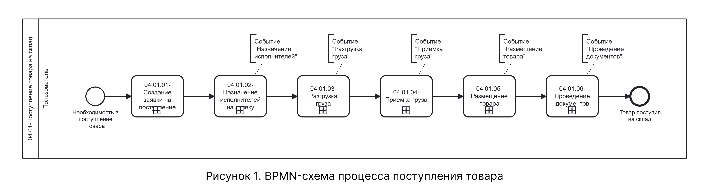
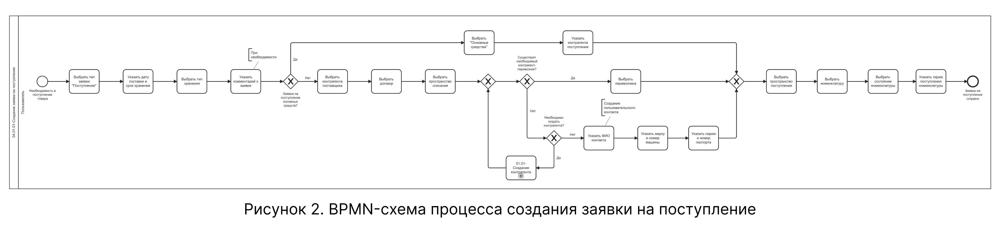
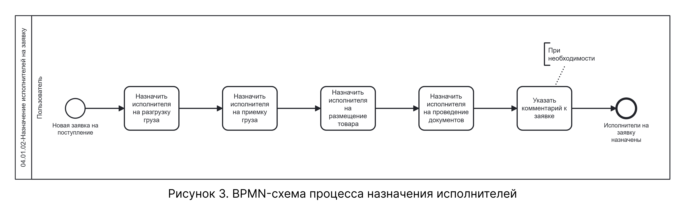
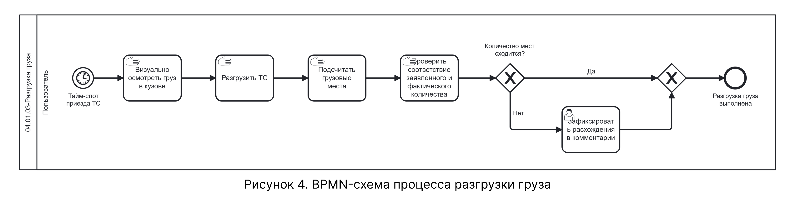
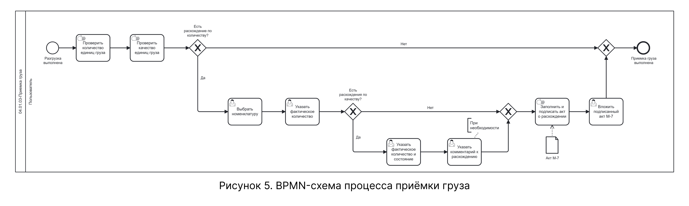
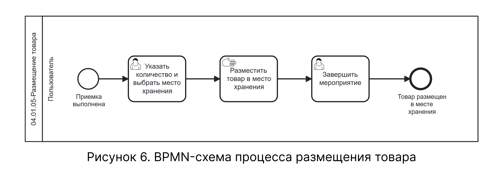
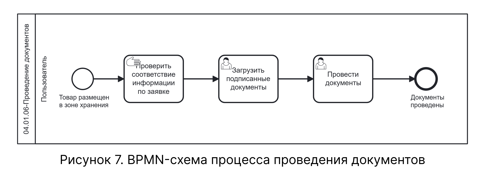

# BPMN-схема процесса поступления товара на склад

На схеме представлен процесс поступления товара на склад — от создания заявки до проведения документов. Процесс включает цепочку последовательных событий, а также точки ветвления для альтернативных и расширяющих сценариев.

Схема содержит следующие свернутые подпроцессы, которые детализированы на отдельных схемах:

- 04.01.01 — Создание заявки на поступление — рисунок 2;
- 04.01.02 — Назначение исполнителей на заявку — рисунок 3;
- 04.01.03 — Разгрузка груза — рисунок 4;
- 04.01.04 — Приёмка груза — рисунок 5;
- 04.01.05 — Размещение товара — рисунок 6;
- 04.01.06 — Проведение документов — рисунок 7.

## Общая схема процесса

На рисунке 1 приведена BPMN-схема верхнего уровня, охватывающая все события процесса поступления товара на склад.

{.center width=1200}

## Подпроцесс 04.01.01 — Создание заявки на поступление

На рисунке 2 представлена декомпозиция подпроцесса «04.01.01 — Создание заявки на поступление». Подпроцесс описывает логику заполнения основной информации заявки, а также ветвление для альтернативного сценария движения основных средств и расширенных сценариев работы с перевозчиком и номенклатурой.

{.center width=1200}

Подпроцесс охватывает шаги 1–17 нормального сценария, альтернативный сценарий движения основных средств (таблица 3 на странице «Описание»), а также расширенные сценарии указания данных о перевозчике (таблица 4.1), добавления перевозчика в качестве контрагента (таблица 4.2) и добавления новой номенклатуры (таблица 4.3). В рамках расширенного сценария добавления перевозчика в качестве контрагента (таблица 4.2) может быть вызван внешний подпроцесс «01.01 — Создание контрагента», детальное описание которого приведено на странице «01 Управление контрагентами → Описание».

## Подпроцесс 04.01.02 — Назначение исполнителей на заявку

На рисунке 3 представлена декомпозиция подпроцесса «04.01.02 — Назначение исполнителей на заявку». Подпроцесс описывает логику назначения ответственных контрагентов на события «Разгрузка груза», «Приёмка груза», «Размещение товара» и «Проведение документов».

{.center width=1200}

Подпроцесс охватывает шаги 18–23 нормального сценария (см. Таблицу 2.2 на странице «Описание»).

## Подпроцесс 04.01.03 — Разгрузка груза

На рисунке 4 представлена декомпозиция подпроцесса «04.01.03 — Разгрузка груза». Подпроцесс описывает логику физической разгрузки поступившего товара: проверку соответствия информации из документов и фактически поступившего груза, указание зоны погрузки, а также ветвление для фиксации расхождений.

{.center width=1200}

Подпроцесс охватывает шаги 24–26 нормального сценария (см. Таблицу 2.3 на странице «Описание»), а также расширенный сценарий фиксации расхождений при разгрузке груза (таблица 4.4).

## Подпроцесс 04.01.04 — Приёмка груза

На рисунке 5 представлена декомпозиция подпроцесса «04.01.04 — Приёмка груза». Подпроцесс описывает логику приёмки товара по качеству и количеству, а также разветвленную систему фиксации расхождений: по количеству, по качеству и фиксацию излишков.

{.center width=1200}

Подпроцесс охватывает шаг 27 нормального сценария (см. Таблицу 2.4 на странице «Описание»), а также расширенные сценарии фиксации расхождений при приёмке груза (Таблица 4.5), фиксации излишков (Таблица 4.6) и фиксации расхождения по качеству (Таблица 4.7).

## Подпроцесс 04.01.05 — Размещение товара

На рисунке 6 представлена декомпозиция подпроцесса «04.01.05 — Размещение товара». Подпроцесс описывает логику размещения поступившего товара на складе: сверку документов, выбор места хранения для каждой позиции номенклатуры с использованием иерархии склада, указание количества на каждом из ярусов.

{.center width=1200}

Подпроцесс охватывает шаги 28–33 нормального сценария (см. Таблицу 2.5 на странице «Описание»).

## Подпроцесс 04.01.06 — Проведение документов

На рисунке 7 представлена декомпозиция подпроцесса «04.01.06 — Проведение документов». Подпроцесс описывает логику завершающего этапа: проверку соответствия информации по заявке, загрузку подписанных документов и финальное проведение.

{.center width=1200}

Подпроцесс охватывает шаги 34–36 нормального сценария (см. Таблицу 2.6 на странице «Описание»).

## Соответствие схемы текстовому описанию

| Узел BPMN-схемы | Соответствие в текстовом описании |
|-----------------|----------------------------------|
| Стартовое событие «Необходимость в поступлении товара» | Таблица 1 |
| Подпроцесс «04.01.01 — Создание заявки на поступление» | Таблицы 2.1, 3, 4.1- 4.3 |
| Подпроцесс «04.01.02 — Назначение исполнителей на заявку» | Таблица 2.2 |
| Подпроцесс «04.01.03 — Разгрузка груза» | Таблицы 2.3, 4.4|
| Подпроцесс «04.01.04 — Приёмка груза» | Таблицы 2.4, 4.5 - 4.7 |
| Подпроцесс «04.01.05 — Размещение товара» | Таблица 2.5 |
| Подпроцесс «04.01.06 — Проведение документов» | Таблица 2.6, шаги 34 - 35 |
| Завершающее событие «Товар поступил на склад» | Таблица 2.6, шаг 36 |