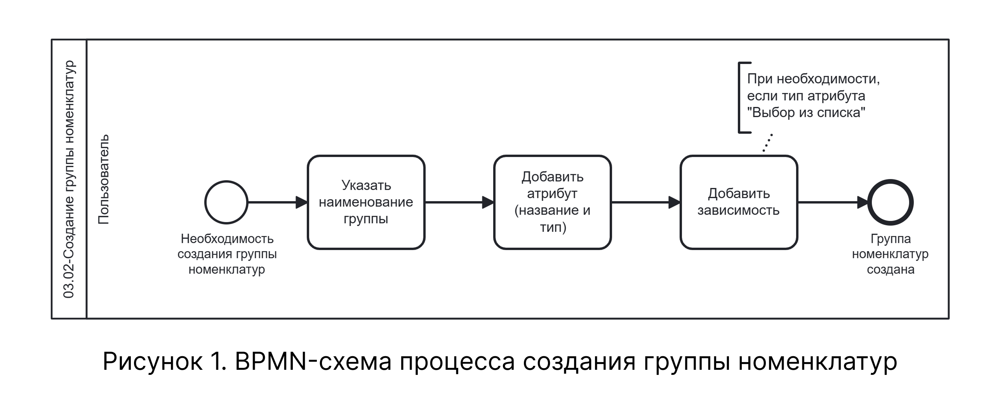

# BPMN-схема процесса создания группы номенклатур

На схеме представлен процесс создания группы номенклатур — от перехода в справочник до сохранения группы с атрибутами в базе данных. Процесс включает одно событие с точками ветвления для выбора типа атрибута и альтернативными сценариями добавления зависимостей, удаления и добавления дополнительных атрибутов.

## Схема процесса

На рисунке 1 приведена BPMN-схема процесса создания группы номенклатур.

{.center width=1200}

Схема охватывает шаги 1–5.2.2 нормального сценария, а также расширенные сценарии удаления атрибута (таблица 3.1), добавления дополнительного атрибута (таблица 3.2) и добавления зависимости (таблица 3.3) текстового описания.

## Соответствие схемы текстовому описанию

| Узел BPMN-схемы | Соответствие в текстовом описании |
|-----------------|----------------------------------|
| Стартовое событие «Переход в справочник "Группы номенклатур"» | Точка входа в процесс: подсистема «Справочники» → «Группы номенклатур» |
| Действие «Указать наименование группы» | Таблица 2, шаг 1 |
| Действие «Добавить атрибут (название и тип)» | Таблица 2, шаги 2–4; Таблица 3.2, шаг 1 |
| Шлюз «Тип атрибута» | Таблица 2, шаг 4 |
| Действие «Заполнить значения списка» | Таблица 2, шаг 5.2.1 |
| Действие «Добавить зависимость» | Таблица 3.3, шаги 1–4 |
| Действие «Удалить атрибут» | Таблица 3.1, шаги 1–2 |
| Завершающее событие «Группа номенклатур создана» | Таблица 2, шаги 5.1, 5.2.2 |