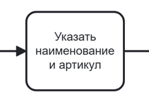
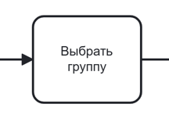
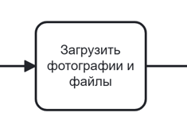
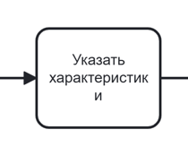
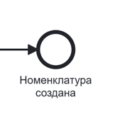

# Управление номенклатурой



Для того, **чтобы таблица была видна полностью, перейдите в режим чтения**:
* найдите иконку «Режим чтения» рядом с иконкой-шестеренкой в правом углу;
* кликните по иконке.
Будет скрыто боковое меню и оглавление, а основная часть информации развернута на всю страницу. 

**Для выхода нажмите «Esc» на клавиатуре**.



## № 1. Создание номенклатуры

BPMN-схема процесса создания номенклатуры находится на странице «BPMN-схема». Формы интерфейса с идентификаторами — на странице «Интерфейс».

### 1.1. Точки входа в процесс

Создание номенклатуры возможно только из подсистемы «Справочники "Группы номенклатур"».

Последовательность шагов для перехода к созданию групп номенклатур описана в Таблице 1.

**Таблица 1. Переход к созданию номенклатуры из подсистемы «Справочники "Группы номенклатур"»**

| Шаг | Действия пользователя | Ожидаемый ответ системы | Идентификатор формы | Примечание |
|-----|----------------------|------------------------|---------------------|------------|
| 1 | Кликнуть в боковом меню по подсистеме «Справочники» | Система разворачивает вложенные значения подсистемы | | — |
| 2 | Кликнуть по значению «Группы номенклатур» | Система выполняет переход в справочник. Отображается страница со списком групп номенклатур | | — |
| 3 | Кликнуть по кнопке «Добавить» | Происходит переход к шагу 1 нормального сценария. Система отображает форму создания группы номенклатуры | | По умолчанию в блоке «Группа номенклатур» предвыбрано значение «Вся номенклатура». Если данная настройка не была изменена, то при создании номенклатуры необходимо вручную заполнить поле «Группа». Если была выбрана любая группа отличная от значения «Вся номенклатура», то поле «Группа» будет предзаполнено выбранным значением, при этом поле доступно для редактирования. |

### 1.2. Нормальный сценарий создания группы номенклатур

Пользовательский путь описан в Таблице 2.

**Таблица 2. Нормальный сценарий создания номенклатуры**

| Шаг | Действия пользователя | Ожидаемый ответ системы | Идентификатор формы | Соответствие на BPMN-схеме | Примечание |
|-----|----------------------|------------------------|---------------------|---------------------------|------------|
| 1 | Ввести наименование номенклатуры в поле «Наименование» | Система отображает введенные символы | |  {.center width=150} | — |
| 2 | Ввести артикул в поле «Артикул» | Система отображает введенные символы | | | — |
| 3 | Ввести артикул в поле «Группа» | Система фиксирует выбранный тип | | {.center width=150} | Если при создании номенклатуры в блоке «Группа» было выбрано любое значение отличное от значения «Вся номенклатура», то поле «Группа» будет предзаполнено выбранным значением, при этом поле доступно для редактирования. |
| 4 | Загрузить фото номенклатуры по кнопке «Прикрепить фото» или через drag-and-drop | Система открывает диалог выбора файла. После выбора файла отображается превью фотографии | |{.center width=150}  | — |
| 5 | Прикрепить вложенные файлы по кнопке «Прикрепить файл» или через drag-and-drop | Система открывает диалог выбора файла. После выбора отображаются имена загруженных файлов | | | — |
| 6 | Заполнить поля в блоке «Характеристики» | Система отображает введенные значения и рассчитывает значения для полей «Объем» и «Площадь». Поля «Объем» и «Площадь» недоступны для редактирования. | | {.center width=150} | Если номенклатура относится к группе номенклатур, то отображается блок с дополнительными полями, которые необходимо заполнить |
| 7 | Нажать кнопку «Сохранить» | Система создает номенклатуру в БД и отображает её в списке номенклатуры | | {.center width=150} | — |