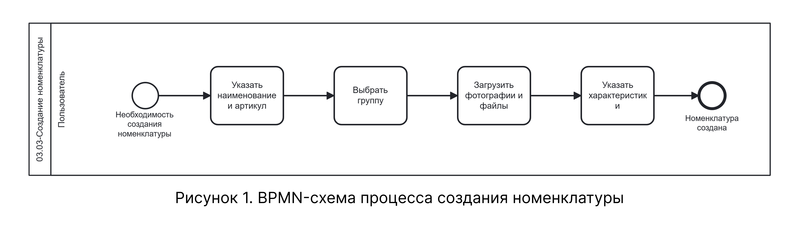

# BPMN-схема процесса создания номенклатуры

На схеме представлен процесс создания номенклатуры — от перехода в справочник до сохранения номенклатуры в базе данных. Процесс включает одно событие с последовательным заполнением полей: наименование и артикул, выбор группы, загрузка фото и файлов, указание характеристик.

## Схема процесса

На рисунке 1 приведена BPMN-схема процесса создания номенклатуры.

{.center width=1200}

Схема охватывает шаги 1–7 нормального сценария текстового описания. Ветвлений и альтернативных сценариев в процессе нет.

## Соответствие схемы текстовому описанию

| Узел BPMN-схемы | Соответствие в текстовом описании |
|-----------------|----------------------------------|
| Стартовое событие «Необхдимость создания номенклатуры» | Таблица 1 |
| Действие «Указать наименование и артикул» | Таблица 2, шаги 1–2 |
| Действие «Выбрать группу» | Таблица 2, шаг 3 |
| Действие «Загрузить фотографии и файлы» | Таблица 2, шаги 4–5 |
| Действие «Указать характеристики» | Таблица 2, шаг 6 |
| Завершающее событие «Номенклатура создана» | Таблица 2, шаг 7 |