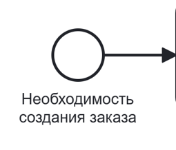
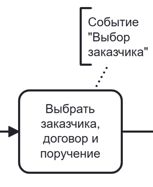
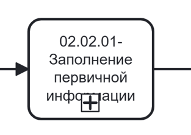
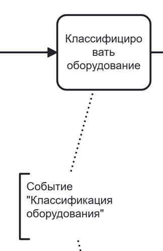
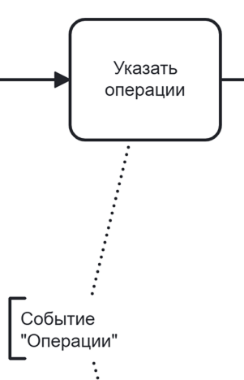
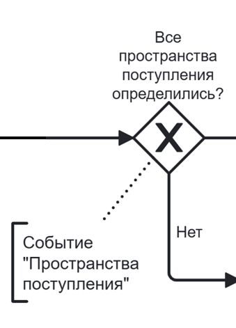
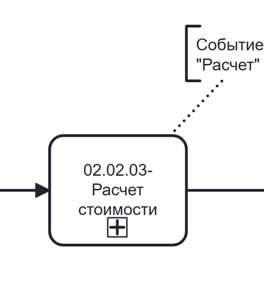
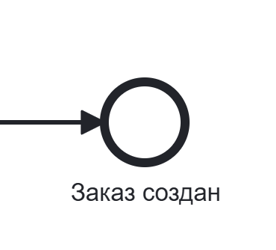
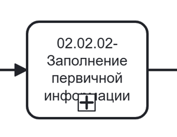
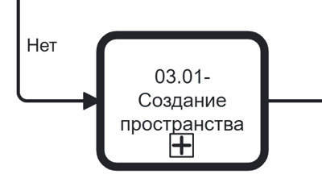

# Управление заказами



Для того, **чтобы таблица была видна полностью, перейдите в режим чтения**:
* найдите иконку «Режим чтения» рядом с иконкой-шестеренкой в правом углу;
* кликните по иконке.
Будет скрыто боковое меню и оглавление, а основная часть информации развернута на всю страницу. 

**Для выхода нажмите «Esc» на клавиатуре**.



## № 1. Создание заказа

BPMN-схема процесса создания заказа находится на странице «BPMN-схема». Формы интерфейса с идентификаторами находятся на странице «Интерфейс».

### 1.1. Точки входа в процесс

Создание заказа возможно из двух подсистем: «Создание заказа» и справочник «Контрагенты». Последовательность шагов при создании заказа отличается в зависимости от точки входа:

* если точкой входа была подсистема «Справочники "Контрагенты"» — первое событие будет «Загрузка файла», так как информация на первом событии («Выбор заказчика») заполнилась автоматически;
* если точкой входа была подсистема «Создание заказа» — первое событие, которое пользователю необходимо будет пройти, будет «Выбор заказчика», следующим событием будет «Загрузка файла».

Последовательность шагов для разных подсистем описана в Таблицах 1.1 и 1.2.

**Таблица 1.1. Переход к созданию заказа из подсистемы «Создание заказа»**

| Шаг | Действия пользователя | Ожидаемый ответ системы | Идентификатор формы | Соответствие на BPMN-схеме |
|-----|----------------------|------------------------|---------------------|---------------------------|
| 1 | Кликнуть в боковом меню по подсистеме «Создание заказа» | Происходит переход к шагу 1 нормального сценария (см. Таблицу 2.1). Система отображает страницу создания заказа на событии «Выбор заказчика» | | {.center width=150} |

**Таблица 1.2. Переход к созданию заказа из подсистемы «Справочники "Контрагенты"»**

| Шаг | Действия пользователя | Ожидаемый ответ системы | Идентификатор формы | Соответствие на BPMN-схеме |
|-----|----------------------|------------------------|---------------------|---------------------------|
| 1 | Кликнуть в боковом меню по подсистеме «Справочники» | Система разворачивает вложенные значения подсистемы | | {.center width=150} |
| 2 | Кликнуть по значению «Контрагенты» | Система выполняет переход в справочник. Отображается страница со списком контрагентов | | |
| 3 | Кликнуть по строке с конкретным контрагентом | Система отображает страницу с информацией о выбранном контрагенте. Информация по умолчанию, которая открывается, — договоры | | |
| 4 | Кликнуть по кнопке «Открыть» в области необходимого договора | Система открывает модальное окно с информацией о договоре | | |
| 5 | Кликнуть на вкладку «Поручения» | Система меняет наполнение модального окна и отображает информацию о поручениях | | |
| 6 | Кликнуть по кнопке «Открыть» в области необходимого поручения | Система открывает модальное окно с информацией о поручении | | |
| 7 | Кликнуть по кнопке «Создать заказ» | Происходит переход к шагу 5 нормального сценария (см. Таблицу 2.2). Система отображает страницу создания заказа на событии «Загрузка файла» | | |

### 1.2. Нормальный сценарий создания заказа

Состав событий отличается в зависимости от выбранного способа заполнения информации.

При мануальном режиме создание заказа состоит из событий: 
* «Выбор заказчика»; 
* «Конфигуратор заказа»; 
* «Даты поставок»; 
* «Техническое задание»; 
* «Назначение исполнителя»; 
* «Классификация оборудования»; 
* «Операции»; 
* «Расчёт».

При заполнении информации с помощью файловой загрузки создание заказа состоит из событий: 
* «Выбор заказчика»; 
* «Загрузка файла»; 
* «Пространства списания»; 
* «Сопоставление номенклатуры»; 
* «Даты поставок»; 
* «Сопоставление услуг»; 
* «Техническое задание»; 
* «Назначение исполнителя»; 
* «Классификация оборудования»; 
* «Операции»; 
* «Пространства поступления»; 
* «Расчёт».

Последовательность шагов в интерфейсе при нормальном сценарии описана в Таблицах 2.1–2.12.

**Таблица 2.1. Событие «Выбор заказчика»**

| Шаг | Действия пользователя | Ожидаемый ответ системы | Идентификатор формы | Соответствие на BPMN-схеме | Примечание |
|-----|----------------------|------------------------|---------------------|---------------------------|------------|
| 1 | Кликнуть в поле «Заказчик» и выбрать контрагента из выпадающего списка | Система отображает список доступных контрагентов. Выбранное значение фиксируется в поле | | {.center width=200} | Поля «Заказчик», «Договор», «Поручение». Если вход выполнен из карточки поручения, поля предзаполнены, событие пропускается автоматически|
| 2 | Выбрать договор из выпадающего списка | Система отображает список договоров, связанных с выбранным заказчиком. Выбранное значение фиксируется | | | |
| 3 | Выбрать поручение из выпадающего списка | Система отображает список поручений, связанных с выбранным договором. Выбранное значение фиксируется | | | |
| 4 | Нажать кнопку «Далее» | Система сохраняет выбранные значения. Происходит переход к событию «Загрузка файла» | | | |

**Таблица 2.2. Событие «Загрузка файла»**

| Шаг | Действия пользователя | Ожидаемый ответ системы | Идентификатор формы | Соответствие на BPMN-схеме | Примечание |
|-----|----------------------|------------------------|---------------------|---------------------------|------------|
| 5 | Кликнуть по иконке «Шаблон» и скачать excel-файл | Система генерирует и отдает файл шаблона для заполнения | | {.center width=150} | Список событий для разного способа заполнения отличается. Альтернативный сценарий заполнения информации в мануальном режиме описан в Таблице 3.1. Развернутая схема подпроцесса представлена на странице «BPMN-схема»|
| 6 | Заполнить excel-файл согласно инструкции в шаблоне | Действие выполняется вне системы | | | Обязательные поля помечены желтым цветом. Наименования дополнительных столбцов обязательны |
| 7 | Нажать кнопку «Прикрепить файл» и выбрать заполненный excel-файл | Система загружает файл и выполняет предварительную валидацию структуры | | | Файл может быть загружен с помощью drag-and-drop. Может быть загружен только один файл |
| 8 | Нажать кнопку «Далее» | Система обрабатывает загруженный файл. Происходит переход к событию «Пространства списания» | | | |

**Таблица 2.3. Событие «Пространства списания»**

| Шаг | Действия пользователя | Ожидаемый ответ системы | Идентификатор формы | Соответствие на BPMN-схеме | Примечание |
|-----|----------------------|------------------------|---------------------|---------------------------|------------|
| 9 | Проверить сопоставление пространств списания из шаблона с данными системы в интерфейсе | Система отображает список сопоставленных пространств списания. Зеленая строка с галочкой — пространство сопоставлено (найдены системное и пользовательское пространства). Красная строка — пространство не сопоставлено. Вверху страницы отображается уведомление о наличии несопоставленных пространств. Альтернативный сценарий, когда хотя бы одно пространство не сопоставлено, описан в Таблице 3.2. | | {.center width=150} | Развернутая схема подпроцесса представлена на странице «BPMN-схема» |
| 10 | Кликнуть по кнопке «Далее» | Система сохраняет сопоставленные пространства. Происходит переход к событию «Сопоставление номенклатуры» | | | Кнопка неактивна, пока есть несопоставленные пространства |

**Таблица 2.4. Событие «Сопоставление номенклатуры»**

| Шаг | Действия пользователя | Ожидаемый ответ системы | Идентификатор формы | Соответствие на BPMN-схеме | Примечание |
|-----|----------------------|------------------------|---------------------|---------------------------|------------|
| 11 | Проверить сопоставление номенклатуры из шаблона со справочником в интерфейсе | Система отображает список подобранной номенклатуры и требуемое количество конкретной номенклатуры для комплектации оборудования. Альтернативный сценарий, когда хотя бы для одного оборудования не подобрана номенклатура, описан в Таблице 3.3. | | {.center width=150} | На текущий момент в системе оборудование может состоять только из одной номенклатуры. Развернутая схема подпроцесса представлена на странице «BPMN-схема» |
| 12 | Кликнуть по кнопке «Далее» | Система сохраняет сопоставленную номенклатуру. Происходит переход к событию «Даты поставок» | | | — |

**Таблица 2.5. Событие «Даты поставок»**

| Шаг | Действия пользователя | Ожидаемый ответ системы | Идентификатор формы | Соответствие на BPMN-схеме | Примечание |
|-----|----------------------|------------------------|---------------------|---------------------------|------------|
| 13 | Указать плановые даты поступления номенклатуры для каждой позиции | Система отображает список номенклатуры с полями для ввода дат | | {.center width=150} | Можно указать несколько дат поставок, если номенклатура поставляется партиями (см. Таблицу 3.4). Развернутая схема подпроцесса представлена на странице «BPMN-схема» |
| 14 | Нажать кнопку «Далее» | Система сохраняет указанные даты. Происходит переход к событию «Сопоставление услуг» | | | |

**Таблица 2.6. Событие «Сопоставление услуг»**

| Шаг | Действия пользователя | Ожидаемый ответ системы | Идентификатор формы | Соответствие на BPMN-схеме | Примечание |
|-----|----------------------|------------------------|---------------------|---------------------------|------------|
| 15 | Проверить сопоставление услуг из шаблона со справочником в интерфейсе | Система отображает список услуг с подобранными значениями. Альтернативный сценарий, когда хотя бы для одной услуги не подобрано сопоставление, описан в Таблице 3.5. | | {.center width=150} | Добавить новую услугу нельзя. Развернутая схема подпроцесса представлена на странице «BPMN-схема»|
| 16 | Нажать кнопку «Далее» | Система сохраняет сопоставленные услуги. Происходит переход к событию «Техническое задание» | | | — |

**Таблица 2.7. Событие «Техническое задание»**

| Шаг | Действия пользователя | Ожидаемый ответ системы | Идентификатор формы | Соответствие на BPMN-схеме | Примечание |
|-----|----------------------|------------------------|---------------------|---------------------------|------------|
| 17 | Ввести текст технического задания в текстовое поле | Система отображает введенный текст | | {.center width=150} | При необходимости можно прикрепить дополнительные файлы по иконке скрепки или через drag-and-drop. Развернутая схема подпроцесса представлена на странице «BPMN-схема»|
| 18 | Нажать кнопку «Далее» | Система сохраняет ТЗ. Происходит переход к событию «Назначение исполнителя» | | | — |

**Таблица 2.8. Событие «Назначение исполнителя»**

| Шаг | Действия пользователя | Ожидаемый ответ системы | Идентификатор формы | Соответствие на BPMN-схеме | Примечание |
|-----|----------------------|------------------------|---------------------|---------------------------|------------|
| 19 | Указать планируемую дату начала заказа | Система отображает датапикер с предзаполненной датой на основании даты поставки номенклатуры. Выбранная дата фиксируется | | {.center width=150} | Развернутая схема подпроцесса представлена на странице «BPMN-схема» |
| 20 | Выбрать тип инициативы клиента: Фиксированная — указать дату вручную; Рассчитываемая — система определит оптимальную дату | Система отображает переключатель типа инициативы. При выборе «Фиксированная» активируется датапикер | | | Инициатива клиента — промежуток времени, за который все задачи по заказу должны быть выполнены |
| 21 | Выбрать ответственного менеджера из выпадающего списка | Система отображает список контрагентов, доступных для назначения ответственными. Выбранное значение фиксируется | | | Ответственный будет выполнять расчет по заказу |
| 22 | Нажать кнопку «Далее» | Система сохраняет введенную информацию. Происходит переход к событию «Классификация оборудования» | | | Если ответственный — другой человек: открывается модальное окно с информацией по заказу. Менеджер получит задачу в списке мероприятий. Если ответственный — текущий пользователь: происходит переход к событию «Классификация оборудования» |

**Таблица 2.9. Событие «Классификация оборудования»**

| Шаг | Действия пользователя | Ожидаемый ответ системы | Идентификатор формы | Соответствие на BPMN-схеме | Примечание |
|-----|----------------------|------------------------|---------------------|---------------------------|------------|
| 23 | Проверить сопоставление типа и вида для оборудования из шаблона со справочником в интерфейсе | Система отображает список типов и видов оборудования с подобранными значениями. Альтернативный сценарий, когда хотя бы для одного оборудования не подобран тип и вид, описан в Таблице 3.6. | | {.center width=150} | Действие на BPMN-схеме - по ветке «Загрузка файлов» |
| 24 | Нажать кнопку «Далее» | Система сохраняет классификацию. Происходит переход к событию «Операции» | | | — |

**Таблица 2.10. Событие «Операции»**

| Шаг | Действия пользователя | Ожидаемый ответ системы | Идентификатор формы | Соответствие на BPMN-схеме | Примечание |
|-----|----------------------|------------------------|---------------------|---------------------------|------------|
| 25 | Кликнуть по кнопке «Добавить операцию» | Система отображает выпадающий список операций, соответствующих выбранной ранее услуге | | {.center width=200} | Необходимо указать минимум одну операцию для каждой услуги каждой связки «оборудование – номенклатура». Действие на BPMN-схеме - по ветке «Загрузка файлов» |
| 26 | Выбрать операции в рамках конкретной услуги | Система запоминает выбор и отображает выбранные операции в интерфейсе | | | |
| 27 | Нажать кнопку «Далее» | Система сохраняет указанные операции. Происходит переход к событию «Пространства поступления» | | | Кнопка «Далее» неактивна до тех пор, пока для всех услуг не указана хотя бы одна операция |

**Таблица 2.11. Событие «Пространства поступления»**

| Шаг | Действия пользователя | Ожидаемый ответ системы | Идентификатор формы | Соответствие на BPMN-схеме | Примечание |
|-----|----------------------|------------------------|---------------------|---------------------------|------------|
| 28 | Проверить сопоставление пространств поступления из шаблона с данными системы в интерфейсе | Система отображает список сопоставленных пространств поступления. Зеленая строка с галочкой — пространство сопоставлено (найдены системное и пользовательское пространства). Красная строка — пространство не сопоставлено. Вверху страницы отображается уведомление о наличии несопоставленных пространств. Альтернативный сценарий, когда хотя бы одно пространство не сопоставлено, описан в Таблице 3.7. | | {.center width=200} | — |
| 29 | Кликнуть по кнопке «Далее» | Система сохраняет сопоставленные пространства. Происходит переход к событию «Расчёт» | | | Кнопка неактивна, пока есть несопоставленные пространства |

**Таблица 2.12. Событие «Расчёт»**

| Шаг | Действия пользователя | Ожидаемый ответ системы | Идентификатор формы | Соответствие на BPMN-схеме | Примечание |
|-----|----------------------|------------------------|---------------------|---------------------------|------------|
| 30 | Указать параметры расчета: процент рисков услуг; транспортные риски; маржа; время выполнения маршрутов; клиентские риски; требуется ли возврат транспортных документов; требуется ли обрешетка | Система отображает поля ввода для каждого параметра. Введенные значения фиксируются | |{.center width=200} | Развернутая схема подпроцесса представлена на странице «BPMN-схема» |
| 31 | Нажать кнопку «Рассчитать» | Система выполняет расчет стоимости заказа на основе указанных параметров и ранее внесенных данных. Отображается диаграмма Ганта | | | Можно просмотреть метрики — альтернативный сценарий просмотра метрик описан в Таблице 3.8. Можно сгенерировать «Коммерческое предложение» в pdf-формате (см. Таблицу 3.8). Также можно осуществить перерасчет стоимости заказа (см. Таблицу 3.8) |
| 32 | Нажать кнопку «Подтвердить» | Система фиксирует выбранную версию как основную. Отображается финальный экран с информацией о заказе | | {.center width=200} | — |

### 1.3. Расширения нормального сценария использования

В таблицах 3.1–3.8 описаны пользовательские сценарии, расширяющие основной.

**Таблица 3.1. «Заполнение информации в мануальном режиме»**

| Шаг | Действия пользователя | Ожидаемый ответ системы | Идентификатор формы | Соответствие BPMN-схеме | Примечание |
|-----|----------------------|------------------------|---------------------|--------------------------|------------|
| **Событие «Конфигуратор заказа»** |||||
| 1 | Кликнуть по кнопке «Добавить» | Система отображает редактируемый элемент | | {.center width=150} | Элемент можно перетащить через drag-and-drop, поменяв порядок. Действие на BPMN-схеме - по ветке «Мануальный режим». Развернутая схема подпроцесса представлена на странице «BPMN-схема» |
| 2 | Ввести наименование для добавляемого поля | Система сохраняет введенные значения и порядок дополнительных полей | | | Добавленные поля можно удалить по иконке урны |
| 3 | Нажать кнопку «Сохранить» | Система сохраняет настроенный шаблон. Изменить шаблон после сохранения нельзя | | | — |
| 4 | Нажать кнопку «Добавить» для создания задачи по заказу | Система открывает модальное окно с формой создания задачи | | | — |
| 5 | Кликнуть по полю пространства списания | Система открывает модальную форму добавления/выбора системного пространства | | | Пространство считается сопоставленным, если найдено и системное, и пользовательское пространство и для заказчика, и для исполнителя. |
| 6 | Выбрать существующее системное пространство из справочника на вкладке «Из справочника» ИЛИ создать новое системное пространство на вкладке «Новое пространство» | При выборе из справочника: система отображает список доступных системных пространств. После выбора происходит переход к выбору пользовательского пространства. При создании нового: система открывает форму создания системного пространства с картой | |  | — |
| 7 | Указать значения для полей «Код пространства» и «Территория». Нажать «Сохранить» | Система создает/привязывает пользовательское пространство и связывает его с выбранным системным. Строка в списке пространств списания становится зеленой с галочкой | | | В зависимости от того, как были сопоставлены пространства, может быть необходимо создать пользовательское пространство: только для заказчика; только для исполнителя; и для заказчика, и для исполнителя. |
| 8 | Кликнуть по кнопке «Сохранить» | Система сохраняет данные для пространства списания | | | — |
| 5.1 | Кликнуть по полю пространства поступления | Система открывает модальную форму добавления/выбора системного пространства | | | Пространство считается сопоставленным, если найдено и системное, и пользовательское пространство и для заказчика, и для исполнителя |
| 6.1 | Выбрать существующее системное пространство из справочника на вкладке «Из справочника» ИЛИ создать новое системное пространство на вкладке «Новое пространство» | При выборе из справочника: система отображает список доступных системных пространств. После выбора происходит переход к выбору пользовательского пространства. При создании нового: система открывает форму создания системного пространства с картой | | | — |
| 7.1 | Указать значения для полей «Код пространства» и «Территория». Нажать «Сохранить» | Система создает/привязывает пользовательское пространство и связывает его с выбранным системным. Строка в списке пространств поступления становится зеленой с галочкой | | | В зависимости от того, как были сопоставлены пространства, может быть необходимо создать пользовательское пространство: только для заказчика; только для исполнителя; и для заказчика, и для исполнителя. |
| 8.1 | Кликнуть по кнопке «Сохранить» | Система сохраняет данные для пространства поступления | | | — |
| 9 | Ввести наименование оборудования | Система отображает введенные символы | | | Поле обязательно для заполнения |
| 10 | Кликнуть по полю номенклатуры | Система отображает список доступной номенклатуры из справочника | | | — |
| 11.1.1 | **Альтернатива: номенклатура не добавлена в системе.** Кликнуть по кнопке «Добавить» | Система открывает форму создания новой номенклатуры | | | — |
| 11.1.2 | Заполнить обязательные поля новой номенклатуры и кликнуть по кнопке «Создать» | Система создает новую номенклатуру в справочнике, автоматически выбирает её в выпадающем списке для текущего оборудования, открывает модальное окно с предзаполненной информацией о номенклатуре | | | Происходит переход к шагу 12 текущего сценария |
| 11.2 | **Альтернатива: номенклатура добавлена в системе.** Выбрать подходящую номенклатуру из списка | Система фиксирует выбранное значение. Открывает модальное окно с предзаполненной информацией о номенклатуре | | | Происходит переход к шагу 12 текущего сценария |
| 12 | Заполнить поля в модальной форме | Система запоминает и отображает введенные значения для полей | | | Состав заполняемых полей зависит от тех атрибутов, которые были присвоены группе номенклатур, к которым относится добавляемая номенклатура. |
| 13 | Кликнуть по кнопке «Сохранить» | Система связывает выбранную номенклатуру и оборудование из файла, закрывает модальное окно. | | | Бизнес-правило: на текущий момент оборудование может состоять только из одной номенклатуры |
| 14 | Кликнуть по иконке добавления с выпадающим списком услуг | Система отображает предопределенный список услуг, доступных в системе | | | Добавить новую услугу нельзя — выбор только из существующего справочника |
| 15 | Выбрать подходящую услугу из списка | Система фиксирует выбранное значение | | | Может быть добавлено любое количество оборудования по кнопке «Добавить оборудование». Для каждого нового добавленного оборудования необходимо пройти шаги с 9 по 15 текущего сценария. |
| 16 | Кликнуть по кнопке «Сохранить» | Система сохраняет задачу, показывает модальное окно со списком задач | | | Может быть добавлено сколь угодно большое количество задач по команде «Добавить» |
| 17 | Кликнуть по кнопке «Далее» | Система сохраняет все задачи. Происходит переход к событию «Даты поставок» | | | — |
| 18 | Указать плановые даты поступления номенклатуры для каждой позиции | Система отображает список номенклатуры с полями для ввода дат | | |
| 19 | Нажать кнопку «Далее» | Система сохраняет указанные даты. Происходит переход к шагу 17 основного сценария (см. Таблица 2.7) | | | — |

**Таблица 3.2. «Сопоставление пространств списания»**

| Шаг | Действия пользователя | Ожидаемый ответ системы | Идентификатор формы | Соответствие BPMN-схеме | Примечание |
|-----|----------------------|------------------------|---------------------|--------------------------|------------|
| 1 | В списке пространств списания найти строку, выделенную красным цветом и кликнуть по ней | Система открывает модальную форму добавления/выбора системного пространства | | {.center width=150} | Пространство считается сопоставленным, если найдено и системное, и пользовательское пространство и для заказчика, и для исполнителя. Подпроцесс на BPMN-схеме по ветке «Загрузка файлов». Развернутая схема подпроцесса представлена на странице «BPMN-схема»|
| 2 | Выбрать существующее системное пространство из справочника на вкладке «Из справочника» ИЛИ создать новое системное пространство на вкладке «Новое пространство» | При выборе из справочника: система отображает список доступных системных пространств. После выбора происходит переход к выбору пользовательского пространства. При создании нового: система открывает форму создания системного пространства с картой | | | — |
| 3 | Указать значения для полей «Код пространства» и «Территория». Нажать «Сохранить» | Система создает/привязывает пользовательское пространство и связывает его с выбранным системным. Строка в списке пространств списания становится зеленой с галочкой | | | В зависимости от того, как были сопоставлены пространства, может быть необходимо создать пользовательское пространство: только для заказчика; только для исполнителя; и для заказчика, и для исполнителя. Сопоставление должно быть выполнено для всех указанных в заявке пространств. |
| 4 | Кликнуть по кнопке «Далее» | Система обновляет статус каждой сопоставленной строки. Происходит переход к шагу 11 основного сценария. | | | Кнопка «Далее» становится активной после сопоставления всех пространств |

**Таблица 3.3. «Сопоставление номенклатуры для оборудования»**

| Шаг | Действия пользователя | Ожидаемый ответ системы | Идентификатор формы | Соответствие BPMN-схеме | Примечание |
|-----|----------------------|------------------------|---------------------|--------------------------|------------|
| 1 | В списке оборудования найти строку, для которой не подобрана номенклатура. Кликнуть по иконке добавления | Система отображает список доступной номенклатуры из справочника | | {.center width=150} | Подпроцесс на BPMN-схеме по ветке «Загрузка файлов». Развернутая схема подпроцесса представлена на странице «BPMN-схема» |
| 2.1.1 | **Альтернатива: номенклатура не добавлена в системе.** Кликнуть по кнопке «Добавить» | Система открывает форму создания новой номенклатуры | | | — |
| 2.1.2 | Заполнить обязательные поля новой номенклатуры и кликнуть по кнопке «Создать» | Система создает новую номенклатуру в справочнике, автоматически выбирает её в выпадающем списке для текущего оборудования, открывает модальное окно с предзаполненной информацией о номенклатуре | | | Происходит переход к шагу 3 текущего сценария |
| 2.2 | **Альтернатива: номенклатура добавлена в системе.** Выбрать подходящую номенклатуру из списка | Система фиксирует выбранное значение. Открывает модальное окно с предзаполненной информацией о номенклатуре | | | Происходит переход к шагу 3 текущего сценария |
| 3 | Заполнить поля в модальной форме | Система запоминает и отображает введенные значения для полей | | | Состав заполняемых полей зависит от тех атрибутов, которые были присвоены группе номенклатур, к которым относится добавляемая номенклатура. |
| 4 | Кликнуть по кнопке «Сохранить» | Система связывает выбранную номенклатуру и оборудование из файла, закрывает модальное окно. | | | Бизнес-правило: на текущий момент оборудование может состоять только из одной номенклатуры |
| 5 | Кликнуть по кнопке «Далее» | Система обновляет статус каждой сопоставленной строки. Происходит переход к шагу 13 основного сценария (см. Таблица 2.5) | | | Необходимо подобрать сопоставление для всего несопоставленного оборудования, иначе кнопка «Далее» будет неактивна |

**Таблица 3.4. «Указание нескольких дат поставок для номенклатуры»**

| Шаг | Действия пользователя | Ожидаемый ответ системы | Идентификатор формы | Соответствие BPMN-схеме | Примечание |
|-----|----------------------|------------------------|---------------------|--------------------------|------------|
| 1 | Кликнуть по полю «Дата поставки» | Система показывает датапикер для выбора даты | | {.center width=150} | Подпроцесс на BPMN-схеме по ветке «Загрузка файлов». Развернутая схема подпроцесса представлена на странице «BPMN-схема» |
| 2 | Указать дату поставки для партии и подтвердить выбор по иконке подтверждения | Система фиксирует выбранную дату, обновляет статус каждой строки | | | В интерфейсе будет отображено несколько полей с датами, если номенклатура поставлялась партиями. Для каждой партии дата поставки указывается отдельно. |

**Таблица 3.5. «Сопоставление услуг»**

| Шаг | Действия пользователя | Ожидаемый ответ системы | Идентификатор формы | Соответствие BPMN-схеме | Примечание |
|-----|----------------------|------------------------|---------------------|--------------------------|------------|
| 1 | В списке услуг найти строку, для которой не подобрано сопоставление и кликнуть по выпадающему списку | Система отображает предопределенный список услуг, доступных в системе | | {.center width=150} | Добавить новую услугу нельзя — выбор только из существующего справочника. Подпроцесс на BPMN-схеме по ветке «Загрузка файлов». Развернутая схема подпроцесса представлена на странице «BPMN-схема» |
| 2 | Выбрать подходящую услугу из списка | Система фиксирует выбранное значение | | | — |
| 3 | Кликнуть по кнопке «Далее» | Система обновляет статус каждой сопоставленной строки. Происходит переход к шагу 17 основного сценария | | | Необходимо подобрать сопоставление для всех несопоставленных услуг, иначе кнопка «Далее» будет неактивна |

**Таблица 3.6. «Сопоставление типов и видов для оборудования»**

| Шаг | Действия пользователя | Ожидаемый ответ системы | Идентификатор формы | Соответствие BPMN-схеме | Примечание |
|-----|----------------------|------------------------|---------------------|--------------------------|------------|
| 1 | В списке оборудования найти строку, для которой не подобран тип или вид. Кликнуть по выпадающему списку в столбце «Тип оборудования» | Система отображает список доступных типов оборудования из справочника | | {.center width=150} | У типа оборудования есть описание, которое можно открыть по подсказке. Действие на BPMN-схеме - по ветке «Загрузка файлов»|
| 2 | Выбрать подходящий тип оборудования из списка | Система фиксирует выбранное значение. Становится доступным выпадающий список «Вид оборудования», содержащий виды, связанные с выбранным типом | | | — |
| 3 | Кликнуть по выпадающему списку в столбце «Вид оборудования» и выбрать подходящее значение | Система фиксирует выбранное значение, обновляет статус каждой сопоставленной строки. | | | — |
| 4 | Нажать кнопку «Далее» | Система сохраняет классификацию. Происходит переход к шагу 25 основного сценария (см. Таблица 2.10). | | | Необходимо подобрать сопоставление для всего несопоставленного оборудования, иначе кнопка «Далее» будет неактивна |

**Таблица 3.7. «Сопоставление пространств поступления»**

| Шаг | Действия пользователя | Ожидаемый ответ системы | Идентификатор формы | Соответствие BPMN-схеме | Примечание |
|-----|----------------------|------------------------|---------------------|--------------------------|------------|
| 1 | В списке пространств поступления найти строку, выделенную красным цветом и кликнуть по ней | Система открывает модальную форму добавления/выбора системного пространства | | {.center width=150} | Пространство считается сопоставленным, если найдено и системное, и пользовательское пространство и для заказчика, и для исполнителя. Развернутая схема подпроцесса представлена на странице «BPMN-схема» |
| 2 | Выбрать существующее системное пространство из справочника на вкладке «Из справочника» ИЛИ создать новое системное пространство на вкладке «Новое пространство» | При выборе из справочника: система отображает список доступных системных пространств. После выбора происходит переход к выбору пользовательского пространства. При создании нового: система открывает форму создания системного пространства с картой | | | — |
| 3 | Указать значения для полей «Код пространства» и «Территория». Нажать «Сохранить» | Система создает/привязывает пользовательское пространство и связывает его с выбранным системным. Строка в списке пространств поступления становится зеленой с галочкой | | | В зависимости от того, как были сопоставлены пространства, может быть необходимо создать пользовательское пространство: только для заказчика; только для исполнителя; и для заказчика, и для исполнителя. Сопоставление должно быть выполнено для всех указанных в заявке пространств. |
| 4 | Кликнуть по кнопке «Далее» | Система обновляет статус каждой сопоставленной строки. Происходит переход к шагу 30 основного сценария (см. Таблица 2.12) | | | Кнопка «Далее» становится активной после сопоставления всех пространств |

**Таблица 3.8. «Просмотр метрик и перерасчёт заказа»**

| Шаг | Действия пользователя | Ожидаемый ответ системы | Идентификатор формы | Соответствие BPMN-схеме | Примечание |
|-----|----------------------|------------------------|---------------------|--------------------------|------------|
| 1 | Кликнуть на кнопку «Метрики» | Система открывает сайд-бар в правой части экрана с суммарными характеристиками по всему заказу | | {.center width=200} | В метриках отображается агрегированная информация: общая стоимость, количество позиций, количество адресов, сроки и другие ключевые показатели заказа. Развернутая схема подпроцесса представлена на странице «BPMN-схема» |
| 2 | Ознакомиться с информацией. Нажать кнопку «Закрыть» или кликнуть вне сайд-бара | Система закрывает сайд-бар. Пользователь возвращается к экрану расчета | | | Происходит переход к шагу 31 основного сценария (см. Таблица 2.12) |
| 3 | Нажать кнопку «Коммерческое предложение» | Система генерирует PDF-файл с коммерческим предложением на основе текущей версии расчета. Происходит переход к шагу 31 основного сценария (см. Таблица 2.12)| | | Файл содержит информацию о заказе, расчете стоимости и условиях. |
| 4 | Нажать кнопку «Планирование» | Система открывает форму с текущими параметрами расчёта | | | — |
| 5 | Изменить один или несколько параметров в модальном окне | Система фиксирует введенные значения | | | Список параметров доступных для изменения: процент рисков услуг; транспортные риски; маржа; время выполнения маршрутов; клиентские риски; возврат транспортных документов; обрешетка |
| 6 | Нажать кнопку «Пересчитать» | Система выполняет новый расчет и создает новую версию. Новая версия добавляется в выпадающий список версий на основном экране расчета | | | Предыдущие версии сохраняются и доступны для выбора. |
| 7 | Закрыть форму планирования | Система возвращает пользователя на основной экран расчета | | | — |
| 8 | Выбрать нужную версию расчета из выпадающего списка «Версии расчета» | Система отображает данные выбранной версии на диаграмме Ганта | | | Происходит переход к шагу 31 основного сценария (см. Таблицу 2.12) |