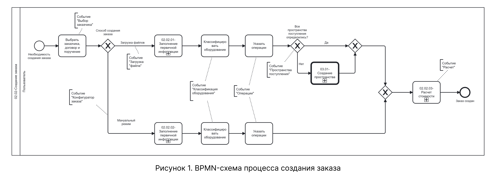
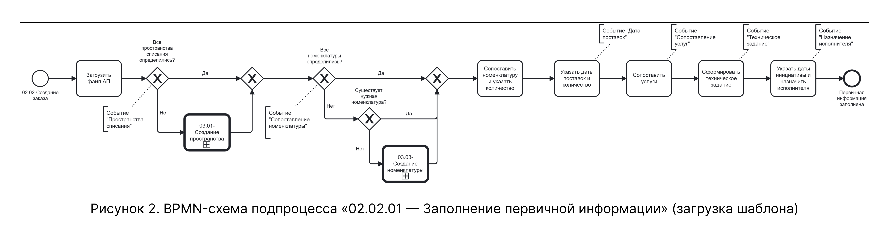
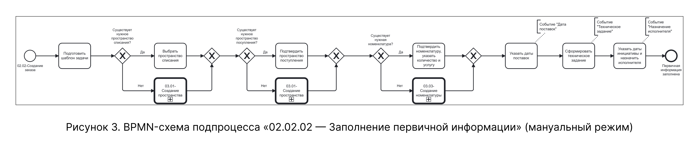
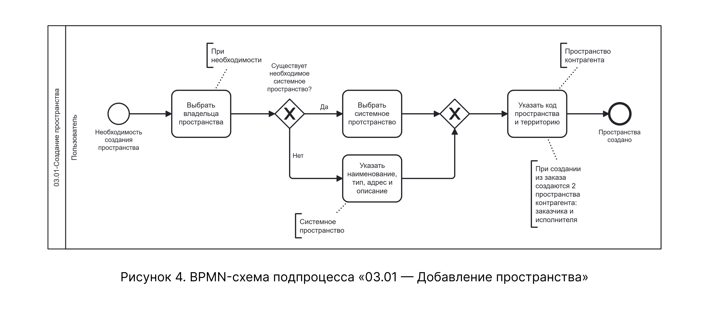

# BPMN-схема процесса создания заказа

На схеме представлен сквозной процесс создания заказа — от инициации мероприятия до фиксации финальной версии расчёта. Процесс включает двенадцать последовательных событий: от «Выбора заказчика» до «Расчёта», а также точки ветвления для альтернативных и расширяющих сценариев.

Схема содержит четыре вложенных подпроцесса, каждый из которых детализирован на отдельных схемах:

* 02.02.01 — Заполнение первичной информации (ветка «Загрузка файлов») — рисунок 2;
* 02.02.02 — Заполнение первичной информации (ветка «Мануальный режим») — рисунок 3;
* 03.01 — Добавление пространства — рисунок 4;
* 02.02.03 — Расчёт стоимости — рисунок 5.

## Общая схема процесса

На рисунке 1 приведена BPMN-схема верхнего уровня, охватывающая все события процесса создания заказа.

{.center width=1200}

## Подпроцесс 02.02.01 — Заполнение первичной информации

На рисунке 2 представлена декомпозиция подпроцесса «02.02.01 — Заполнение первичной информации» для ветки «Загрузка файлов». Подпроцесс охватывает события от загрузки excel-файла до формирования технического задания и назначения исполнителя.

{.center width=1200}

Внутри данного подпроцесса вызывается подпроцесс **03.01 — Добавление пространства**, который рассмотрен далее (см. Рисунок 4).

## Подпроцесс 02.02.02 — Заполнение первичной информации

На рисунке 3 представлена декомпозиция подпроцесса «02.02.02 — Заполнение первичной информации» для ветки «Мануальный режим». Подпроцесс описывает альтернативный путь заполнения данных без использования файла — через конфигуратор заказа и ручной ввод.

{.center width=1200}

Внутри данного подпроцесса вызывается подпроцесс **03.01 — Добавление пространства**, который рассмотрен далее (см. Рисунок 4).

## Подпроцесс 03.01 — Добавление пространства

На рисунке 4 представлена декомпозиция подпроцесса «03.01 — Добавление пространства». Подпроцесс описывает логику выбора или создания системного пространства, а также последующее создание связанного с ним пользовательского пространства.

{.center width=1200}

## Подпроцесс 02.02.03 — Расчёт стоимости

На рисунке 5 представлена декомпозиция подпроцесса «02.02.03 — Расчёт стоимости». Подпроцесс описывает финальный этап создания заказа: ввод параметров расчёта, выполнение расчёта, просмотр метрик, генерацию коммерческого предложения и перерасчёт с созданием новых версий.

{.center width=1200}

*Рисунок 5. BPMN-схема подпроцесса «02.02.03 — Расчёт стоимости»*

Детально сценарии работы с расчётом описаны в таблицах 2.12 и 3.8 текстового описания.

## Соответствие схемы текстовому описанию

| Узел BPMN-схемы | Соответствие в текстовом описании |
|-----------------|----------------------------------|
| Стартовое событие «Необходимость создания заказа» | Точки входа в процесс: подсистема «Создание заказа» (Таблица 1) или справочник «Контрагенты» (Таблица 2) |
| Действие «Выбрать заказчика, договор и поручение» | Таблица 3, шаги 1–4 |
| Свернутый подпроцесс «02.02.01 — Заполнение первичной информации» (ветка «Загрузка файлов») | Таблицы 4–10, шаги 5–22. Детализация — рисунок 2 |
| Действие «Загрузить файл АП» | Таблица 4, шаги 5–8 |
| Шлюз «Все пространства списания определились?» | Таблица 5, шаги 9–10. Альтернативный сценарий — Таблица 3.2 |
| Шлюз «Все номенклатуры определились?» | Таблица 6, шаги 11–12. Альтернативный сценарий — Таблица 3.3 |
| Действие «Указать даты поставок и количество» | Таблица 7, шаги 13–14 |
| Действие «Сопоставить услуги» | Таблица 8, шаги 15–16 |
| Действие «Сформировать техническое задание» | Таблица 9, шаги 17–18 |
| Действие «Указать даты инициативы и назначить исполнителя» | Таблица 10, шаги 19–22 |
| Свернутый подпроцесс «02.02.02 — Заполнение первичной информации» (ветка «Мануальный режим») | Таблица 3.1. Детализация — рисунок 3 |
| Действие «Подготовить шаблон задачи» | Таблица 3.1, шаги 1–3 |
| Действие «Выбрать пространство списания» | Таблица 3.1, шаги 5–8 |
| Действие «Подтвердить пространство поступления» | Таблица 3.1, шаги 5.1–8.1 |
| Действие «Подтвердить номенклатуру, указать количество и услугу» | Таблица 3.1, шаги 10–15 |
| Подпроцесс «03.01 — Добавление пространства» | Таблицы 3.2 и 3.7. Детализация — рисунок 4 |
| Шлюз «Существует необходимое системное пространство?» | Таблица 3.2, шаг 1; Таблица 3.7, шаг 1 |
| Действие «Выбрать системное пространство» | Таблица 3.2, шаг 2; Таблица 3.7, шаг 2 |
| Действие «Указать наименование, тип, адрес и описание» | Таблица 3.2, шаг 2; Таблица 3.7, шаг 2 |
| Действие «Указать код пространства и территорию» | Таблица 3.2, шаг 3; Таблица 3.7, шаг 3 |
| Событие «Пространства созданы» | Таблица 3.2, шаг 4; Таблица 3.7, шаг 4 |
| Действие «Классифицировать оборудование» | Таблица 11, шаги 23–24. Альтернативный сценарий — Таблица 3.6 |
| Действие «Указать операции» | Таблица 12, шаги 25–27 |
| Шлюз «Все пространства поступления определились?» | Таблица 13, шаги 28–29. Альтернативный сценарий — Таблица 3.7 |
| Свернутый подпроцесс «02.02.03 — Расчёт стоимости» | Таблица 14, шаги 30–32. Детализация — рисунок 5 |
| Действие «Просмотр метрик» | Таблица 3.8 |
| Действие «Генерация коммерческого предложения» | Таблица 3.9 |
| Действие «Перерасчёт стоимости» | Таблица 3.10 |
| Завершающее событие «Заказ создан» | Таблица 14, шаг 32 |