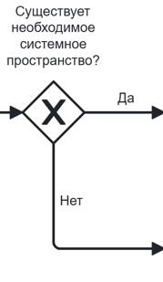
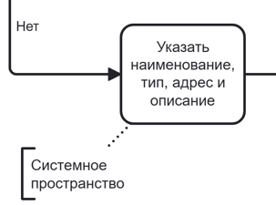
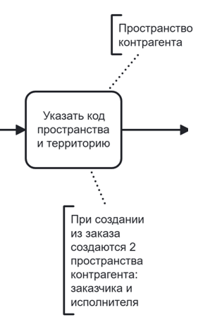
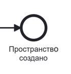
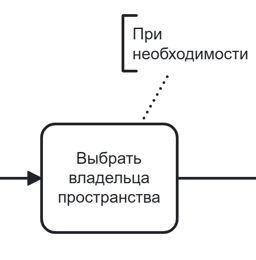
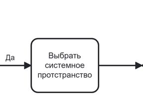

# Управление пространствами



Для того, **чтобы таблица была видна полностью, перейдите в режим чтения**:
* найдите иконку «Режим чтения» рядом с иконкой-шестеренкой в правом углу;
* кликните по иконке.
Будет скрыто боковое меню и оглавление, а основная часть информации развернута на всю страницу. 

**Для выхода нажмите «Esc» на клавиатуре**.



## № 1. Создание пространства

BPMN-схема процесса создания пространства находится на странице «BPMN-схема». Формы интерфейса с идентификаторами — на странице «Интерфейс».

### 1.1. Точки входа в процесс

Создание пространства возможно из нескольких точек:
1. из справочника «Пространства»;
2. при создании контрагента;
3. при создании заказа (где также есть 2 точки входа: подсистема «Создать заказ», поручение в договоре конкретного контрагента).

Последовательность шагов отличается для разных точек входа: один сценарий для точки 1, второй сценарий — точки 2 и 3. 

Также при создании заказа сценарий создания пространства может выполняться несколько раз (при создании пространств списания и пространств поступления для заказчика и исполнителя).

Последовательность шагов для перехода к одному из сценариев создания пространства описана в Таблицах 1.1 – 1.5.

**Таблица 1.1. Переход к созданию пространства из подсистемы «Справочники "Пространства"»**

| Шаг | Действия пользователя | Ожидаемый ответ системы | Идентификатор формы | Примечание |
|-----|----------------------|------------------------|---------------------|------------|
| 1 | Кликнуть в боковом меню по подсистеме «Справочники» | Система разворачивает вложенные значения подсистемы | | — |
| 2 | Кликнуть по значению «Пространства» | Система выполняет переход в справочник. Отображается страница со списком пользовательских пространств | | — |
| 3 | Кликнуть по кнопке «Создать пространство» | Система отображает форму создания системного пространства. | | Происходит переход к шагу 1 нормального сценария (см. Таблицу 2) |

**Таблица 1.2. Переход к созданию пространства при создании контрагента (из подсистемы «Справочники "Контрагенты"»)**

| Шаг | Действия пользователя | Ожидаемый ответ системы | Идентификатор формы | Примечание |
|-----|----------------------|------------------------|---------------------|------------|
| 1 | Кликнуть в боковом меню по подсистеме «Справочники» | Система разворачивает вложенные значения подсистемы | | — |
| 2 | Кликнуть по значению «Контрагенты» | Система выполняет переход в справочник. Отображается страница со списком контрагентов | | — |
| 3 | Кликнуть по кнопке «Создать контрагента» | Система инициирует мероприятие «Создание контрагента». Отображается стартовая страница мероприятия | | — |
| 4 | Создать пользователя | Система создает пользователя для создаваемого контрагента и переходит к блоку с основной информацией | | |
| 5 | Заполнить основную информацию о контрагенте | Система сохраняет заполненные данные и переходит к блоку создания банковских реквизитов | | |
| 6 | Создать банковский реквизит | Система сохраняет заполненные данные и переходит к блоку создания пространств. | | Происходит переход к шагу 1 нормального сценария (см. Таблицу 2)|

**Таблица 1.3. Переход к созданию пространства при создании контрагента (из подсистемы «Мероприятия»)**

| Шаг | Действия пользователя | Ожидаемый ответ системы | Идентификатор формы | Примечание |
|-----|----------------------|------------------------|---------------------|------------|
| 1 | Кликнуть в боковом меню по подсистеме «Мероприятия» | Система выполняет переход в подсистему «Мероприятия». Отображается страница со списком мероприятий | | — |
| 2 | Кликнуть по кнопке «Создать мероприятие» | Система отображает выпадающий список со значениями: «Новый контрагент», «Работа склада» | | — |
| 3 | Кликнуть по значению «Новый контрагент» | Система инициирует мероприятие «Создание контрагента». Отображается стартовая страница мероприятия | | — |
| 4 | Создать пользователя | Система создает пользователя для создаваемого контрагента и переходит к блоку с основной информацией | | — |
| 5 | Заполнить основную информацию о контрагенте | Система сохраняет заполненные данные и переходит к блоку создания банковских реквизитов | | — |
| 6 | Создать банковский реквизит | Система сохраняет заполненные данные и переходит к блоку создания пространств. | | Происходит переход к шагу 1 нормального сценария (см. Таблицу 2) |

**Таблица 1.4. Переход к созданию пространства при создании заказа (из подсистемы «Создание заказа»)**

| Шаг | Действия пользователя | Ожидаемый ответ системы | Идентификатор формы | Примечание |
|-----|----------------------|------------------------|---------------------|------------|
| 1 | Кликнуть в боковом меню по подсистеме «Создание заказа» | Происходит переход к шагу 1 нормального сценария. Система отображает страницу создания заказа на событии «Выбор заказчика» | | — |
| 2 | Пройти событие выбор заказчика | Система сохраняет заполненные данные и переходит к одному из событий «Загрузка файла» или «Конфигуратор заказа» | | — |
| 3.1.1 | Загрузить файл | Система обработала файл и переходит к событию «Пространства списания» | | Необходимо, чтобы часть пространств не сопоставилась автоматически и подбор пространств списания происходил вручную для дальнейшего перехода по шагам сценария |
| 3.1.2 | Сопоставить пространства списания | Система запоминает данные и происходит переход к следующему событию | | Происходит переход к шагу 1 нормального сценария (см. Таблицу 2)  |
| 3.1.3 | Пройти события «Сопоставление номенклатуры», «Даты поставок», «Сопоставление услуг», «Техническое задание», «Назначение исполнителя», «Классификация оборудования», «Операции» | Система запоминает данные и последовательно переходит от события к событию | | — |
| 3.1.4 | Сопоставить пространства поступления | Система запоминает данные и происходит переход к следующему событию | | Происходит переход к шагу 1 нормального сценария (см. Таблицу 2)  |
| 3.2.1 | Создать шаблон для задачи | Система запоминает данные и происходит переход к следующему модальному окну | | — |
| 3.2.2 | Кликнуть по полю пространства списания и выполнить сценарий из Таблицы 2. | Система запоминает данные и происходит переход к следующему модальному окну | | — |
| 3.2.3 | Кликнуть по полю пространства поступления | Система запоминает данные и происходит переход к следующему модальному окну | | Происходит переход к шагу 1 нормального сценария (см. Таблицу 2) |

**Таблица 1.5. Переход к созданию пространства при создании заказа (из подсистемы «Справочники "Контрагенты"»)**

| Шаг | Действия пользователя | Ожидаемый ответ системы | Идентификатор формы | Примечание |
|-----|----------------------|------------------------|---------------------|------------|
| 1 | Кликнуть в боковом меню по подсистеме «Справочники» | Система разворачивает вложенные значения подсистемы | | — |
| 2 | Кликнуть по значению «Контрагенты» | Система выполняет переход в справочник. Отображается страница со списком контрагентов | | — |
| 3 | Кликнуть по строке с конкретным контрагентом | Система отображает страницу с информацией о выбранном контрагенте. Информация по умолчанию, которая открывается, — договоры | | — |
| 4 | Кликнуть по кнопке «Открыть» в области необходимого договора | Система открывает модальное окно с информацией о договоре | | — |
| 5 | Кликнуть на вкладку «Поручения» | Система меняет наполнение модального окна и отображает информацию о поручениях | | — |
| 6 | Кликнуть по кнопке «Открыть» в области необходимого поручения | Система открывает модальное окно с информацией о поручении | | — |
| 7 | Кликнуть по кнопке «Создать заказа» | Система сохраняет заполненные данные и переходит к одному из событий «Загрузка файла» или «Конфигуратор заказа» | | — |
| 3.1.1 | Загрузить файл | Система обработала файл и переходит к событию «Пространства списания» | | Необходимо, чтобы часть пространств не сопоставилась автоматически и подбор пространств списания происходил вручную для дальнейшего перехода по шагам сценария |
| 3.1.2 | Сопоставить пространства списания | Система запоминает данные и происходит переход к следующему событию | | Происходит переход к шагу 1 нормального сценария (см. Таблицу 2)  |
| 3.1.3 | Пройти события «Сопоставление номенклатуры», «Даты поставок», «Сопоставление услуг», «Техническое задание», «Назначение исполнителя», «Классификация оборудования», «Операции» | Система запоминает данные и последовательно переходит от события к событию | | — |
| 3.1.4 | Сопоставить пространства поступления | Система запоминает данные и происходит переход к следующему событию | | Происходит переход к шагу 1 нормального сценария (см. Таблицу 2)  |
| 3.2.1 | Создать шаблон для задачи | Система запоминает данные и происходит переход к следующему модальному окну | | — |
| 3.2.2 | Кликнуть по полю пространства списания и выполнить сценарий из Таблицы 2. | Система запоминает данные и происходит переход к следующему модальному окну | | — |
| 3.2.3 | Кликнуть по полю пространства поступления и выполнить сценарий из Таблицы 2. | Система запоминает данные и происходит переход к следующему модальному окну | | — |

### 1.2. Нормальный сценарий создания пространства

Основным сценарием является создание пространств при создании контрагента и/или заказа, поэтому этот сценарий рассмотрен как основной в Таблице 2, создание из справочника рассмотрено в качестве альтернативного в Таблице 3.

Создание пространства при создании контрагента и/или заказа возможно двумя способами:
- создание нового системного пространства — с последующим созданием пользовательского;
- выбор существующего системного пространства из справочника — с последующим созданием пользовательского.

В качестве основного сценария будет описано создание нового системного пространства, сценарий с выбором существующего описан в расширенном сценарии создания (см. Таблицу 4).

**Таблица 2. Нормальный сценарий создания пространства**

| Шаг | Действия пользователя | Ожидаемый ответ системы | Идентификатор формы | Соответствие на BPMN-схеме | Примечание |
|-----|----------------------|------------------------|---------------------|---------------------------|------------|
| 1 | Выбрать вкладку «Новое пространство» | Система меняет содержание модального в соответствии с выбором | | {.center width=200}| Расширенный сценарий, когда системное пространство выбирается из существующих, описан в Таблице 4. |
| 2 | Ввести наименование системного пространства в поле «Наименование» | Система отображает введенные символы | | {.center width=200} | — |
| 3 | Выбрать тип пространства из выпадающего списка | Система отображает список значений: • Офис • Склад • Торговая точка • Юридический адрес • Адрес для корреспонденции. Выбранное значение фиксируется | | | Также может быть заполнено необязательное поле «Описание» |
| 4 | Указать адрес одним из способов: а) ввести адрес в поисковой строке в верхней части карты; б) установить метку вручную на карте с помощью мыши; в) ввести географические координаты (широту и долготу) в соответствующие поля в левом нижнем углу карты | а) Система выполняет геокодирование, находит адрес и устанавливает метку автоматически. б) Система устанавливает метку в указанном месте. в) Система устанавливает метку по введенным координатам | | | — |
| 5 | Нажать кнопку «Далее» | Система создает системное пространство в БД и открывает модальное окно пользовательского пространства | | | — |
| 6 | Проверить предзаполненные данные о наименовании, адресе и типе пространства. При необходимости — отредактировать | Система отображает форму создания пользовательского пространства с данными, перенесенными из системного пространства. Поля доступны для редактирования | | {.center width=200} | — |
| 7 | Ввести код пространства вручную ИЛИ нажать кнопку «↻» для автоматической генерации кода | Система отображает введенный код ИЛИ генерирует уникальный код и отображает его в поле | | | — |
| 8 | Выбрать территорию из выпадающего списка | Система отображает список доступных территорий. Выбранное значение фиксируется | | | — |
| 9 | Нажать кнопку «Сохранить» | Система создает пользовательское пространство в БД, связывает его с системным пространством. | |{.center width=150} | — |

### 1.3. Альтернативный сценарий создания пространства

**Таблица 3. Альтернативный сценарий создания пространства**

| Шаг | Действия пользователя | Ожидаемый ответ системы | Идентификатор формы | Соответствие на BPMN-схеме | Примечание |
|-----|----------------------|------------------------|---------------------|---------------------------|------------|
| 1 | В поле «Владелец» выбрать контрагента из выпадающего списка | Система отображает список доступных контрагентов. Выбранное значение фиксируется | | {.center width=150}| Основной сценарий описан в Таблице 2. |
| 2 | Выбрать тип пространства из выпадающего списка | Система отображает список значений: • Офис • Склад • Торговая точка • Юридический адрес • Адрес для корреспонденции. Выбранное значение фиксируется | | {.center width=200} | — |
| 3 | Ввести наименование системного пространства в поле «Наименование» | Система отображает введенные символы | | | При необходимости ввести описание в поле «Описание» |
| 4 | Ввести адрес пространства | Система отображает введенные символы | | | — |
| 5 | Нажать кнопку «Далее» | Система создает системное пространство. Происходит переход к модальному окну пользовательского пространства. | | {.center width=200} | — |
| 6 | Проверить предзаполненные данные о наименовании, адресе и типе пространства. При необходимости — отредактировать | Система отображает форму создания пользовательского пространства с данными, перенесенными из системного пространства. Поля доступны для редактирования | | | — |
| 7 | Ввести код пространства вручную ИЛИ нажать кнопку «↻» для автоматической генерации кода | Система отображает введенный код ИЛИ генерирует уникальный код и отображает его в поле | | | — |
| 8 | Выбрать территорию из выпадающего списка | Система отображает список доступных территорий. Выбранное значение фиксируется | | | — |
| 9 | Нажать кнопку «Создать» | Система создает пользовательское пространство в БД, связывает его с системным пространством. Происходит переход к карточке системного пространства. | | {.center width=150} | — |
| 10 | В карточке системного пространства перейти на вкладку «Топология» | Система отображает текущую топологию пространства (по умолчанию создана только зона погрузки) | | — | Топология — иерархия компонентов, из которых состоит склад. Важна для указания места хранения и выполнения складских операций |
| 11.1 | **Альтернатива со стандартными компонентами:** перетащить необходимый компонент из набора справа на вкладку «Топология» | Система добавляет выбранный компонент в топологию | | — | Стандартные компоненты: этаж, сектор, ряд, ярус, место хранения |
| 11.2 | **Альтернатива со своими компонентами:** нажать кнопку «Добавить». Указать наименование и параметры нового компонента. Нажать «Сохранить» | Система создает новый компонент и добавляет его в набор доступных. Компонент можно перетащить в топологию | | — | — |
| 12 | Выстроить иерархию компонентов в соответствии со структурой склада | Система отображает созданную иерархию | | — | Например: этаж → сектор → ряд → ярус → место хранения |
| 13 | Нажать кнопку «Сохранить топологию» | Система сохраняет топологию. Подчиненные пользовательские пространства наследуют топологию у системного | | — | — |

### 1.4. Расширения нормального сценария использования

В Таблице 4 описан пользовательский сценарий, расширяющий основной.

**Таблица 4. Расширенный сценарий создания пространства**

| Шаг | Действия пользователя | Ожидаемый ответ системы | Идентификатор формы | Соответствие на BPMN-схеме | Примечание |
|-----|----------------------|------------------------|---------------------|---------------------------|------------|
| 1 | Выбрать вкладку «Из справочника» | Система меняет содержание модального в соответствии с выбором | | {.center width=200} | Основной сценарий, когда системное пространство создается, описан в Таблице 2. |
| 2 | В форме добавления пространства выбрать существующее системное пространство одним из способов: • кликнуть по точке на карте; • выбрать одно из пространств в списке; • найти пространство по наименованию в списке | Система выделяет выбранное пространство | |  {.center width=200} | — |
| 3 | Нажать кнопку «Далее» | Система запоминает выбранное системное пространство. Происходит переход к шагу 6 нормального сценария (см. Таблицу 2) | | | — |