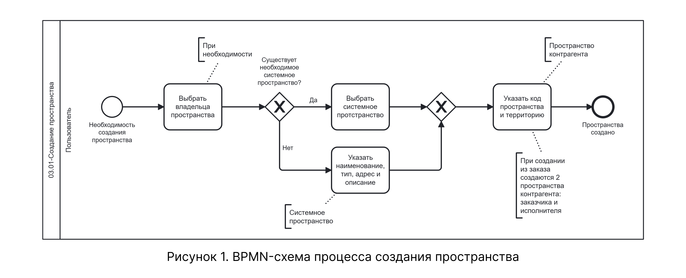

# BPMN-схема процесса создания пространства

На схеме представлен процесс создания пространства — от инициации создания до сохранения пользовательского пространства и настройки топологии склада. Процесс включает выбор способа создания (новое системное пространство или выбор из справочника), заполнение данных системного и пользовательского пространства, а также опциональную настройку топологии с добавлением стандартных или пользовательских компонентов.

## Схема процесса

На рисунке 1 приведена BPMN-схема процесса создания пространства.

{.center width=1200}

Схема охватывает шаги 1–9 нормального сценария (Таблица 2), шаги 1–13 альтернативного сценария (Таблица 3), а также расширенный сценарий выбора существующего системного пространства (Таблица 4) текстового описания.

## Соответствие схемы текстовому описанию

| Узел BPMN-схемы | Соответствие в текстовом описании |
|-----------------|----------------------------------|
| Стартовое событие «Необходимость создания пространства» | Точки входа в процесс: справочник «Пространства», создание контрагента, создание заказа |
| Шлюз «Существует необходимое системное пространство?» | Таблица 2, шаг 1; Таблица 4, шаг 1 |
| Действие «Выбрать системное пространство» | Таблица 4, шаг 2 |
| Действие «Указать наименование, тип, адрес и описание» | Таблица 2, шаги 2–5; Таблица 3, шаги 2–4 |
| Действие «Указать код пространства и территорию» | Таблица 2, шаги 6–8; Таблица 3, шаги 6–8 |
| Завершающее событие «Пространство создано» | Таблица 2, шаг 9; Таблица 3, шаг 9 |
| Действие «Выбрать владельца пространства» | Таблица 3, шаг 1 |